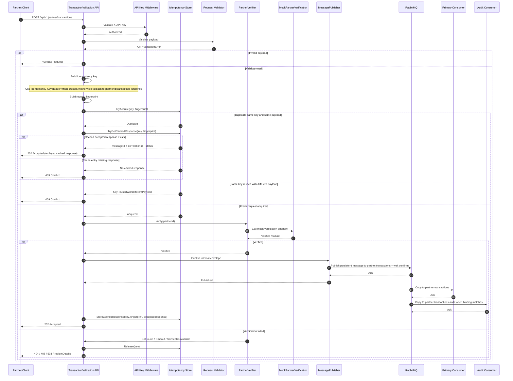

# TransactionValidation — Partner Integration BFF

A lightweight Backend-For-Frontend (BFF) to mediate partner integrations for transaction verification and routing.

## Technology Stack

### Coding and Runtime

| Area | Stack |
|---|---|
| Runtime / Framework | .NET 8 (`net8.0`) |
| API | ASP.NET Core Web API |
| API documentation | Swagger / OpenAPI (`Swashbuckle.AspNetCore`) |
| Validation | FluentValidation |
| Security | API key authentication (`X-API-Key` middleware) |
| Idempotency | `Idempotency-Key` support with in-memory or Redis-backed TTL dedupe, cached `202 Accepted` replay, and conflict on payload mismatch |
| Error handling | ASP.NET Core `IExceptionHandler` + RFC 7807 `ProblemDetails` mapping |
| Resilience | `Microsoft.Extensions.Http.Resilience` (Polly-based pipelines) |
| Messaging | RabbitMQ (`RabbitMQ.Client`) or Azure Service Bus (`Azure.Messaging.ServiceBus`), selected by `MESSAGING__BROKERTYPE` |
| Observability | Serilog, OpenTelemetry, optional Azure Monitor exporter |
| Configuration | `appsettings*.json`, environment variables, `DotNetEnv` |
| Architecture | Multi-project solution (`Api`, `Configuration`, `Core`, `Integration`, `Messaging`, `Mock`, `Tests`) |

### Testing and Quality

| Area | Stack / Practice |
|---|---|
| Unit testing | xUnit, Moq, FluentAssertions |
| Integration testing | ASP.NET Core `WebApplicationFactory<Program>` |
| E2E testing | Docker Compose runtime smoke tests |
| Coverage collection | `coverlet.collector` with Cobertura XML |
| Coverage reporting | `dotnet-reportgenerator-globaltool` with HTML, Markdown, and text reports |
| Coverage target | At least 80% for filtered business and application logic |
| Quality gates | Format verification, solution build, unit tests, and split unit/integration coverage workflows |

### Deployment and Operations

| Area | Stack / Practice |
|---|---|
| Containerization | Docker, Docker Compose |
| Local infrastructure | RabbitMQ and Redis |
| Cloud messaging | Azure Service Bus |
| Distributed idempotency | Azure Cache for Redis |
| Cloud runtime | Azure Container Apps |
| Infrastructure as code | Bicep |
| CI/CD | GitHub Actions with OIDC |
| Secrets and identity | Azure Key Vault and managed identities |

Docker Compose includes Redis for the distributed idempotency store. The API connects to `redis:6379` inside the Compose network; when the API runs on the host, use `localhost:6379` instead.

## Supported broker modes

The solution supports two runtime messaging modes:

- `RabbitMq` — local default for Docker-based development and validation
- `AzureServiceBus` — Azure Service Bus topic/subscription mode for cloud validation and deployment

Only one broker implementation is active at a time, selected by the `MESSAGING__BROKERTYPE` environment variable.

## Architecture Overview (Sequence)

Primary architecture overview: [docs/architecture_design/Architecture_design.md](docs/architecture_design/Architecture_design.md)

Messaging topology and routing: [docs/architecture_design/messaging_topology_and_consumer_routing.md](docs/architecture_design/messaging_topology_and_consumer_routing.md)

Message lifecycle and runtime flow: [docs/diagram/message_processing_lifecycle_sequence.md](docs/diagram/message_processing_lifecycle_sequence.md)




## Coverage and Test Reports

Coverage is separated by test level. Unit and integration tests produce Cobertura-based coverage reports; E2E remains a runtime validation workflow and produces TRX results rather than a coverage report.

| Goal | Task | Scope | Output |
|---|---|---|---|
| Unit coverage | `test:coverage:unit:full` | Business and application logic | `TestResults/coverage/report` |
| Integration coverage | `test:coverage:integration:full` | API host, middleware, health checks, and component boundaries | `TestResults/coverage/integration-report` |
| Combined coverage | `test:coverage:full` | Unit and integration Cobertura data with business-logic filters | `TestResults/coverage/combined-report` |
| E2E runtime validation | `test:e2e` | Docker, Redis, RabbitMQ, API, Mock, and network behavior | `TestResults/e2e/e2e-tests.trx` |
| Full quality workflow | `quality:full` | Format verification, build, and complete coverage | Coverage reports plus build/format results |

The combined report is the authoritative overall coverage result. Do not average unit and integration percentages manually.

E2E is intentionally separate from `test:coverage:full`: it validates the real container and broker runtime but is not collected as Cobertura coverage.

The separate `test:integration:trx` task should only be run when a dedicated integration TRX/Markdown execution report is required, because it executes the integration tests independently from coverage.

## Quick local run

```bash
# build the solution
dotnet build --nologo -m:1 TransactionValidation.sln
```

Environment setup
```bash
cp .env.example .env
# then set MESSAGING__BROKERTYPE to RabbitMq or AzureServiceBus
# and configure the matching broker settings in .env
```

Docker compose run
```bash
docker compose up --build
```

Service endpoints when compose is running:

- API: http://localhost:5000
- Mock partner verification API and consumer observations: http://localhost:5002
- RabbitMQ management (when RabbitMQ is selected): http://localhost:15672
- Azure Service Bus endpoint depends on the configured namespace and connection settings

Repository entrypoint for implementation, workflow, and architecture documentation.

## Documentation

Start here: [docs/README.md](docs/README.md)

Azure deployment entry point: [docs/azure_deployment/README.md](docs/azure_deployment/README.md)

The documentation set includes architecture, topology, and runtime sequence references for both broker implementations.

## Requirement to Implementation Traceability

Requirement-to-implementation review summary: [docs/analysis/requirement_to_implementation_traceability_summary.md](docs/analysis/requirement_to_implementation_traceability_summary.md)

Latest integration test summary report: [TestResults/integration/integration-tests-summary.md](TestResults/integration/integration-tests-summary.md)

The detailed documentation map, contribution workflow, and topic navigation live in the docs index so the project README stays focused on the codebase and the primary entrypoint.

## License

- TBD
