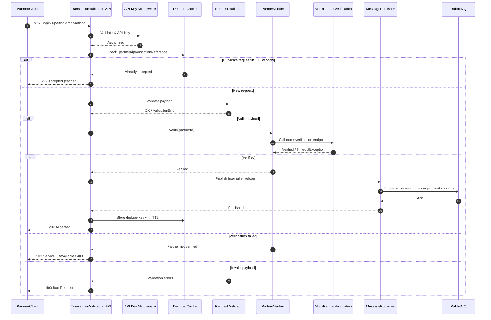

# TransactionValidation — Partner Integration BFF

A lightweight Backend-For-Frontend (BFF) to mediate partner integrations for transaction verification and routing.

Technology stack

| Area | Stack |
|---|---|
| Runtime / Framework | .NET 8 (`net8.0`) |
| API | ASP.NET Core Web API |
| API documentation | Swagger / OpenAPI (`Swashbuckle.AspNetCore`) |
| Validation | FluentValidation |
| Security | API key authentication (`X-API-Key` middleware) |
| Idempotency | `Idempotency-Key` support with in-memory TTL dedupe fallback (`partnerId|transactionReference`) |
| Resilience | `Microsoft.Extensions.Http.Resilience` (Polly-based pipelines) |
| Messaging | RabbitMQ (`RabbitMQ.Client`) |
| Observability | Serilog, OpenTelemetry, optional Azure Monitor exporter |
| Configuration | `appsettings*.json`, environment variables, `DotNetEnv` |
| Containerization | Docker, Docker Compose |
| Architecture | Multi-project solution (`Api`, `Configuration`, `Core`, `Integration`, `Messaging`, `Mock`, `Tests`) |
| Testing | xUnit, Moq, FluentAssertions |
| Quality gates | Split CI workflows for unit and integration tests with explicit category filters |

## Architecture Overview (Sequence)

Primary architecture overview: [docs/architecture_design/Architecture_design.md](docs/architecture_design/Architecture_design.md)



Quick local run
```bash
dotnet restore
dotnet build
dotnet test -v normal
```

Docker compose run
```bash
cp .env.example .env
docker compose up --build
```

Service endpoints when compose is running:

- API: http://localhost:5000
- Mock partner verification API: http://localhost:5002
- RabbitMQ management: http://localhost:15672

Repository entrypoint for implementation, workflow, and architecture documentation.

## Documentation

Start here: [docs/README.md](docs/README.md)

The detailed documentation map, contribution workflow, and topic navigation live in the docs index so the project README stays focused on the codebase and the primary entrypoint.

## License

- TBD
