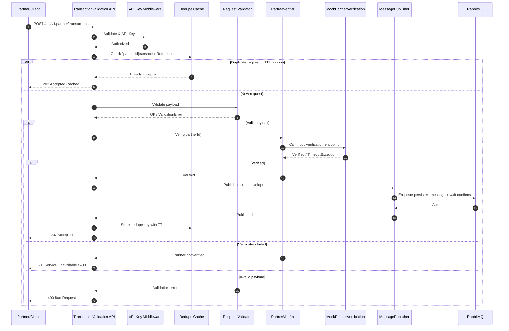

# TransactionValidation — Partner Integration BFF

A lightweight Backend-For-Frontend (BFF) to mediate partner integrations for transaction verification and routing.

Technology stack

| Area | Stack |
|---|---|
| Runtime / Framework | .NET 8 (`net8.0`) |
| API | ASP.NET Core Web API |
| Validation | FluentValidation |
| Resilience | Polly |
| Messaging | RabbitMQ |
| Observability | Serilog, OpenTelemetry |
| Architecture | Multi-project solution (`Api`, `Configuration`, `Core`, `Integration`, `Messaging`, `Mock`, `Tests`) |
| Quality gates | Split CI workflows for unit and integration tests with explicit category filters |

## Architecture Overview (Sequence)

Primary architecture flow (mirrors [docs/diagram/use_case_sequence_diagram.md](docs/diagram/use_case_sequence_diagram.md)):



Quick local run
```bash
dotnet restore
dotnet build
dotnet test -v normal
```

Repository entrypoint for implementation, workflow, and architecture documentation.

## Documentation Map

### Implementation
- Prerequisites: [docs/implementation/Prerequisites/README.md](docs/implementation/Prerequisites/README.md)
- Phase plan and checklist: [docs/implementation/implementation_phases.md](docs/implementation/implementation_phases.md)
- Scaffold and wiring guidance: [docs/implementation/implementation_scaffold.md](docs/implementation/implementation_scaffold.md)
- Principle rules (MUST/SHOULD): [docs/implementation/principle_rules.md](docs/implementation/principle_rules.md)

### GitHub Workflow Actions
- Workflow docs index: [docs/workflow_actions/github/README.md](docs/workflow_actions/github/README.md)
- CI workflow details: [docs/workflow_actions/github/ci_workflow.md](docs/workflow_actions/github/ci_workflow.md)
- Integration workflow details: [docs/workflow_actions/github/integration_workflow.md](docs/workflow_actions/github/integration_workflow.md)
- Workflow fix case studies: [docs/workflow_actions/github/workflow_case_studies.md](docs/workflow_actions/github/workflow_case_studies.md)

### Analysis and Design
- Solution analysis: [docs/analysis/solution_analysis.md](docs/analysis/solution_analysis.md)
- Use case diagram: [docs/diagram/use_case_diagram.md](docs/diagram/use_case_diagram.md)
- Use case sequence diagram: [docs/diagram/use_case_sequence_diagram.md](docs/diagram/use_case_sequence_diagram.md)

### Requirements
- Interview requirements: [reqs/Senior_net_interview_2026.md](reqs/Senior_net_interview_2026.md)

## Contributing

- Follow the implementation phases: [docs/implementation/implementation_phases.md](docs/implementation/implementation_phases.md)
- Keep workflow/documentation updates aligned with: [docs/workflow_actions/github/README.md](docs/workflow_actions/github/README.md)

## License

- TBD
