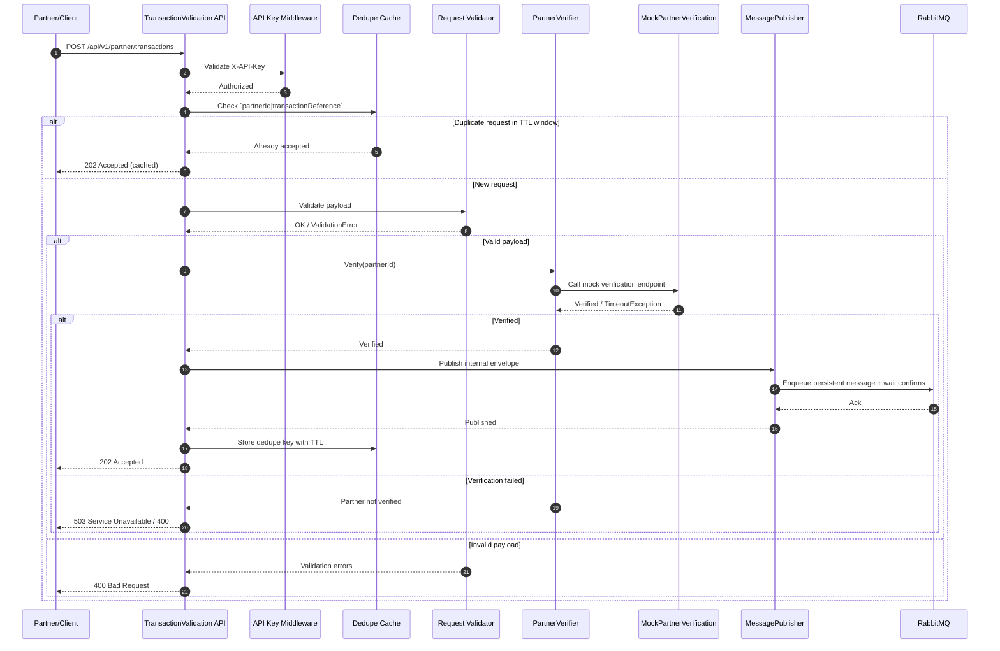

# TransactionValidation — Partner Integration BFF

A lightweight Backend-For-Frontend (BFF) to mediate partner integrations for transaction verification and routing.

Technology stack

| Area | Stack |
|---|---|
| Runtime / Framework | .NET 8 (`net8.0`) |
| API | ASP.NET Core Web API |
| Validation | FluentValidation |
| Resilience | Polly |
| Messaging | RabbitMQ |
| Observability | Serilog, OpenTelemetry |
| Architecture | Multi-project solution (`Api`, `Configuration`, `Core`, `Integration`, `Messaging`, `Mock`, `Tests`) |
| Quality gates | Split CI workflows for unit and integration tests with explicit category filters |

## Architecture Overview (Sequence)

Primary architecture flow (mirrors [docs/diagram/use_case_sequence_diagram.md](docs/diagram/use_case_sequence_diagram.md)):



Quick local run
```bash
dotnet restore
dotnet build
dotnet test -v normal
```

Repository entrypoint for implementation, workflow, and architecture documentation.

## Documentation

Start here: [docs/README.md](docs/README.md)

The detailed documentation map, contribution workflow, and topic navigation live in the docs index so the project README stays focused on the codebase and the primary entrypoint.

## License

- TBD
