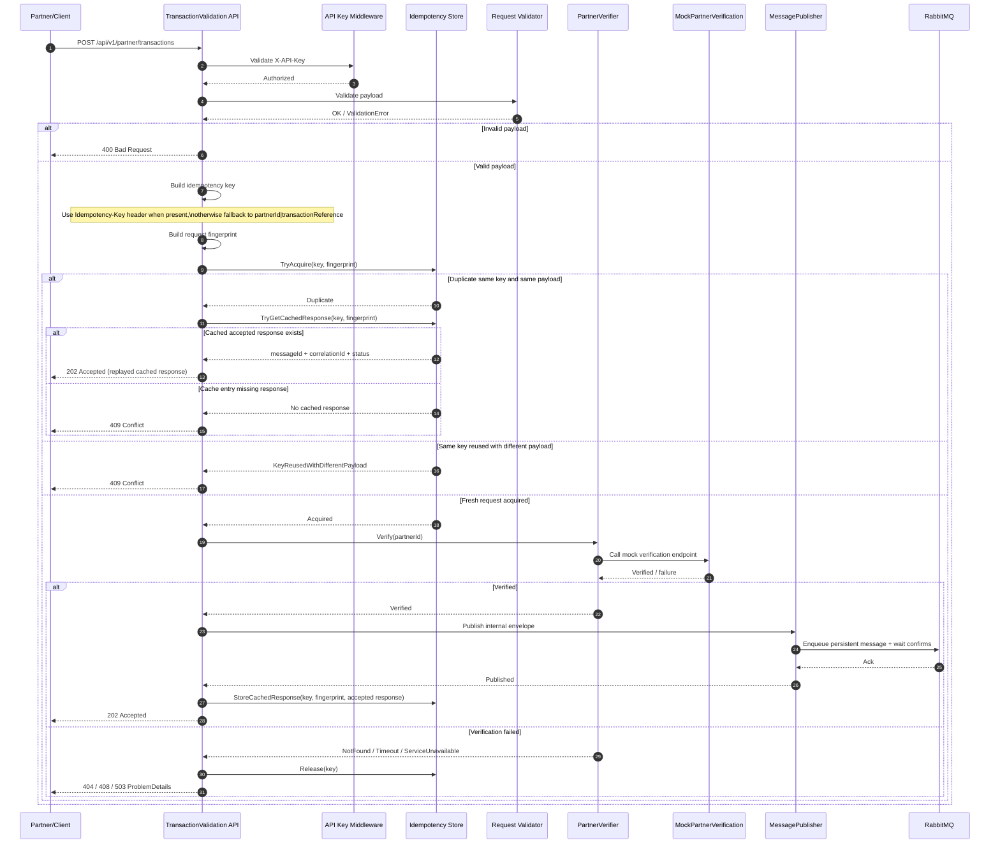

# TransactionValidation — Partner Integration BFF

A lightweight Backend-For-Frontend (BFF) to mediate partner integrations for transaction verification and routing.

Technology stack

| Area | Stack |
|---|---|
| Runtime / Framework | .NET 8 (`net8.0`) |
| API | ASP.NET Core Web API |
| API documentation | Swagger / OpenAPI (`Swashbuckle.AspNetCore`) |
| Validation | FluentValidation |
| Security | API key authentication (`X-API-Key` middleware) |
| Idempotency | `Idempotency-Key` support with in-memory TTL dedupe, cached `202 Accepted` replay for same key+payload, and conflict on key reuse with different payload (`partnerId|transactionReference` fallback) |
| Error handling | ASP.NET Core `IExceptionHandler` + RFC 7807 `ProblemDetails` mapping |
| Resilience | `Microsoft.Extensions.Http.Resilience` (Polly-based pipelines) |
| Messaging | RabbitMQ (`RabbitMQ.Client`) |
| Observability | Serilog, OpenTelemetry, optional Azure Monitor exporter |
| Configuration | `appsettings*.json`, environment variables, `DotNetEnv` |
| Containerization | Docker, Docker Compose |
| Architecture | Multi-project solution (`Api`, `Configuration`, `Core`, `Integration`, `Messaging`, `Mock`, `Tests`) |
| Testing | xUnit, Moq, FluentAssertions, ASP.NET Core integration-host tests (`WebApplicationFactory<Program>`) |
| Coverage | `coverlet.collector` (XPlat Code Coverage, Cobertura XML) + `dotnet-reportgenerator-globaltool` (HTML/Markdown/Text reports) |
| Quality gates | Split CI workflows for unit and integration tests with explicit category filters |

## Architecture Overview (Sequence)

Primary architecture overview: [docs/architecture_design/Architecture_design.md](docs/architecture_design/Architecture_design.md)



Quick local run
```bash
dotnet restore
dotnet build
dotnet test -v normal
```

Unit test coverage
```bash
dotnet test --nologo -m:1 tests/TransactionValidation.Tests/TransactionValidation.Tests.csproj \
	--filter "Category!=Integration&Category!=E2E" \
	--collect "XPlat Code Coverage" \
	--results-directory TestResults/coverage
```

Coverage artifacts are written under `TestResults/coverage/<test-run-guid>/` (for example `coverage.cobertura.xml`).

Coverage report formats (HTML and Markdown)
```bash
dotnet tool restore
dotnet tool run reportgenerator \
	-reports:"TestResults/coverage/**/coverage.cobertura.xml" \
	-targetdir:"TestResults/coverage/report" \
	-reporttypes:"Html;MarkdownSummary;TextSummary"
```

Generated report outputs:
- `TestResults/coverage/report/index.html`
- `TestResults/coverage/report/Summary.md`
- `TestResults/coverage/report/Summary.txt`

VS Code tasks:
- `test:coverage:unit` collects coverage XML
- `test:coverage:report` converts XML to HTML/Markdown/Text
- `test:coverage` runs both tasks in sequence

Docker compose run
```bash
cp .env.example .env
docker compose up --build
```

Service endpoints when compose is running:

- API: http://localhost:5000
- Mock partner verification API: http://localhost:5002
- RabbitMQ management: http://localhost:15672

Repository entrypoint for implementation, workflow, and architecture documentation.

## Documentation

Start here: [docs/README.md](docs/README.md)

## Requirement to Implementation Traceability

Requirement-to-implementation review summary: [docs/analysis/requirement_to_implementation_traceability_summary.md](docs/analysis/requirement_to_implementation_traceability_summary.md)

Latest integration test summary report: [TestResults/integration/integration-tests-summary.md](TestResults/integration/integration-tests-summary.md)

The detailed documentation map, contribution workflow, and topic navigation live in the docs index so the project README stays focused on the codebase and the primary entrypoint.

## License

- TBD
