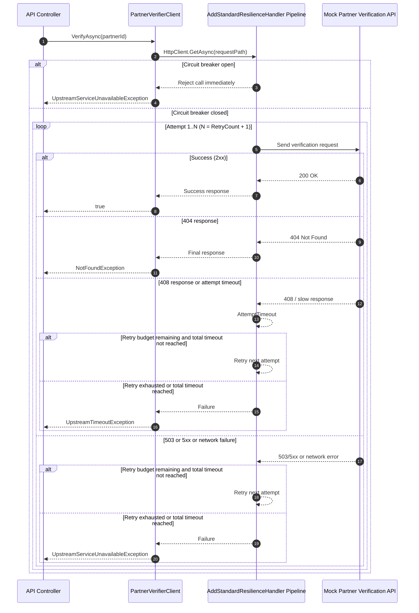

# Resilience Guide for Partner Verification

This guide explains how retry and timeout behavior is implemented in the current codebase, and why developers must not add manual retry loops in the verifier client.

## Decision

Use the built-in HTTP resilience pipeline configured through AddStandardResilienceHandler in DI.
Do not implement manual while or for retry loops inside PartnerVerifierClient.

## Where It Is Configured

- Pipeline registration: src/TransactionValidation.Configuration/Extensions/ServiceCollectionExtensions.cs
- Runtime options: src/TransactionValidation.Configuration/Options/PartnerVerificationOptions.cs
- Call site and exception mapping: src/TransactionValidation.Integration/PartnerVerifierClient.cs

## Runtime Behavior

The typed HttpClient for IPartnerVerifier is configured with:

- Retry attempts: options.Retry.MaxRetryAttempts = PartnerVerificationOptions.RetryCount
- Per-attempt timeout: options.AttemptTimeout.Timeout = PartnerVerificationOptions.AttemptTimeoutSeconds
- Total request timeout: options.TotalRequestTimeout.Timeout = PartnerVerificationOptions.TotalRequestTimeoutSeconds
- Circuit breaker:
  - MinimumThroughput = max(2, PartnerVerificationOptions.CircuitBreakerFailures)
  - BreakDuration = PartnerVerificationOptions.CircuitBreakerDurationSeconds

The HttpClient.Timeout is also set to the same effective total timeout budget.

## Request Handling Sequence

## Default Values

From PartnerVerificationOptions:

- RetryCount = 3
- TimeoutSeconds = 10 (legacy fallback)
- AttemptTimeoutSeconds = 10
- TotalRequestTimeoutSeconds = 30
- CircuitBreakerFailures = 5
- CircuitBreakerDurationSeconds = 30

Fallback logic in ServiceCollectionExtensions ensures safe effective values:

- Attempt timeout falls back to TimeoutSeconds when AttemptTimeoutSeconds is not positive.
- Total timeout falls back to a computed value based on attempt timeout and retry count when TotalRequestTimeoutSeconds is not positive.
- Total timeout is forced to be greater than attempt timeout.

## Why Manual Retry Loops Are Prohibited

Manual retry loops in PartnerVerifierClient create duplicated policy behavior and make failures harder to reason about.

Using one centralized resilience pipeline avoids:

- Double retries (manual loop plus handler retry)
- Conflicting timeout semantics
- Inconsistent telemetry and troubleshooting data
- Divergent behavior between environments

## Exception Semantics at the API Boundary

PartnerVerifierClient maps outcomes into domain exceptions:

- 404 -> NotFoundException
- 408 -> UpstreamTimeoutException
- 503 and other 5xx -> UpstreamServiceUnavailableException
- TaskCanceledException without caller cancellation -> UpstreamTimeoutException
- HttpRequestException -> UpstreamServiceUnavailableException

These are then mapped to ProblemDetails in ApiExceptionHandler.

## How To Tune Safely

Only tune resilience through configuration options and shared DI wiring.
Do not tune by adding ad hoc retry code in the client.

Safe tuning workflow:

1. Change PartnerVerification options in appsettings or environment variables.
2. Keep PartnerVerifierClient focused on request composition and status translation only.
3. Re-run resilience unit tests and integration tests.

## Test Evidence

- Retry behavior tests:
  - tests/TransactionValidation.Tests/Unit/TransactionValidation.Configuration/PartnerVerifierResilienceRetryTests.cs
- Verifier exception mapping tests:
  - tests/TransactionValidation.Tests/Unit/TransactionValidation.Integration/PartnerVerifierClientTests.cs
- Host exception mapping tests:
  - tests/TransactionValidation.Tests/Unit/TransactionValidation.Configuration/ApiExceptionHandlerTests.cs
