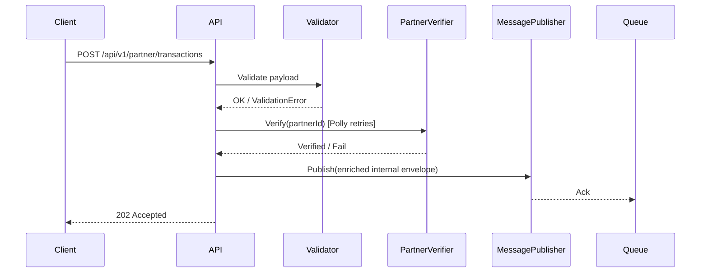

# Partner Integration BFF — Solution Analysis

## Summary

This document captures a deep analysis of the interview assignment, clarifying questions, a proposed multi-project .NET 8 architecture, recommended technologies, the request-to-queue workflow, testing and quality approach, and next steps to implement the solution.

## Requirements (extracted)

- Endpoint: `POST /api/v1/partner/transactions` accepting JSON payload with: `partnerId`, `transactionReference`, `amount`, `currency`, `timestamp`.
- Input validation: all fields required, `amount > 0`, `currency` must be a valid ISO code.
- Partner verification: call a mock `Partner Verification API` (30% TimeoutException behavior). Must implement retries/resilience.
- On success, publish transaction to a local message queue.
- Tests: Unit tests with xUnit or NUnit covering validation logic and resilience/retry mechanism.
- Bonus: Dockerize with `docker-compose` including the local message queue; Global exception handler; secure endpoint.

## Ambiguities / Clarifying Questions

1. Enrichment: Decision — no separate enrichment API is required. Partner verification is the only external integration. After successful verification, the BFF enriches the internal queue message with envelope metadata and `partnerVerified: true`.
2. Message schema: Do you expect a specific schema on the queue (incoming payload only, or payload + verification/enrichment metadata)?
3. Delivery semantics: Is at-least-once acceptable or is exactly-once required?
4. Retry policy bounds: Any constraints for max retries, maximum elapsed time, or total timeout budget for partner verification?
5. Security: Decision — use API key authentication for service-to-service calls rather than JWT or mTLS.
6. Persistence/audit: Should transactions be persisted locally before publishing (for auditing / replay)?

## Proposed Architecture (multi-project solution)

TransactionValidation.sln

- TransactionValidation.Api
  - ASP.NET Core 8 Web API (controller or minimal API)
  - `POST /api/v1/partner/transactions`
  - Middleware: API key validation, global exception handler, request logging, metrics hooks
  - Security: validate `X-API-Key` before processing partner requests

- TransactionValidation.Core
  - Domain models (e.g., `PartnerTransaction`), validation logic, DTOs
  - Service interfaces: `IPartnerVerifier`, `IMessagePublisher`

- TransactionValidation.Integration
  - `PartnerVerificationClient` (uses `HttpClient`)
  - Polly resilience policies (retry/backoff, circuit-breaker)

- TransactionValidation.Messaging
  - `IMessagePublisher` interface
  - `RabbitMqPublisher` implementation (using `RabbitMQ.Client`), publisher confirms
  - (Optional) `AzureQueuePublisher` (swap-able implementation)

- TransactionValidation.Mock
  - Mock partner verification controller that returns success 70% of time, and throws `TimeoutException` (or simulates timeout) 30% of the time.

- TransactionValidation.Tests
  - xUnit tests for validation, resilience, and message publisher behavior

Notes:
- Keep controllers thin — delegate to application services.
- Use DI and `IOptions<T>` for configuration (Polly policies, RabbitMQ connection, queues, timeouts).

## Technology Choices & Rationale

- .NET 8 (required)
- ASP.NET Core Web API
- Polly — resilience (retry, backoff, circuit breaker, timeout)
- RabbitMQ + `RabbitMQ.Client` — chosen because the assignment requests a local message queue and RabbitMQ is easy to run locally via Docker and supports reliable publish confirms and routing patterns. Azure Queue is a valid alternative if the target environment is Azure-only; however RabbitMQ is preferable for local development and richer messaging semantics.
- xUnit + Moq + FluentAssertions — unit testing and mocking
- System.Text.Json for serialization
- Docker + docker-compose — for the API + RabbitMQ local stack (bonus)

## Message Broker Decision

Recommendation: RabbitMQ for this exercise.

Why RabbitMQ:

- Runs locally with a single Docker image and management UI.
- Supports durable queues, publisher confirms, routing and easy integration for testing.
- Best for interview/demo scenarios requiring a local broker.

When to choose Azure Queues/Service Bus:

- If the production target is Azure and you want managed queues with built-in scaling and integration with other Azure services, pick Azure Service Bus or Azure Storage Queues and implement a separate `AzureQueuePublisher`.

## Request → Queue Workflow (detailed)

0. Client includes the API key header: `X-API-Key: <secret>`.
   - Middleware validates the value before request processing.
   - If missing or invalid, return `401 Unauthorized` immediately.
0.5. Check in-memory dedupe cache using `partnerId|transactionReference` (for example, `P-1001|TXN-99823`).
   - If the key exists and has not expired, return the same accepted response without reprocessing.
   - If the key is new or expired, continue.
   - Use a short TTL (e.g. 10–15 minutes) so retry windows are covered but memory does not grow indefinitely.
1. Client POSTs JSON to `POST /api/v1/partner/transactions`.
2. ASP.NET Core model-binding → DTO.
3. Validation layer executes:
   - All fields present
   - `amount > 0`
   - `currency` matches allowed ISO currency list (use NodaMoney or a small list for test)
4. Call `IPartnerVerifier.VerifyAsync(partnerId)` (integration client):
   - Uses `HttpClient` with Polly policies: `TimeoutPolicy` -> `RetryPolicy` with jittered exponential backoff -> `CircuitBreakerPolicy`.
   - If verification ultimately fails, return a `4xx/5xx` with consistent error payload.
5. Map the verified transaction to an internal queue envelope containing `messageType`, generated `messageId`, propagated/generated `correlationId`, `receivedAt`, the original transaction, and `partnerVerified: true`.
6. `IMessagePublisher.PublishAsync(message)`
   - For RabbitMQ: publish as persistent message, use publisher confirms and retry on transient connectivity errors.
   - Wait for publisher confirmation (ACK) from RabbitMQ before returning success.
   - If RabbitMQ NACKs or confirm times out, retry according to policy; if publish still fails, return an error.
   - This is an at-least-once delivery model; duplicate messages may occur, so downstream consumers should be idempotent on `transactionReference`.
7. Return `202 Accepted` to client after broker confirmation.

Sequence diagram (mermaid):



## Resilience & Retry Strategy (suggested)

- Policy choice: configurable, defaulting to: `3` retries, `2s` per-call timeout, and a `30s` maximum elapsed time for partner verification attempts. Make these settings available via `IOptions<PartnerVerificationOptions>`.
- Timeout policy: per-call timeout (default `2s`) enforced with Polly `TimeoutPolicy`.
- Retry policy: default `3` retries with exponential backoff + random jitter (e.g., 200ms * 2^attempt + jitter). Retries should respect the per-call timeout and cancellation token.
- Total timeout: fail fast if total elapsed time for verification attempts exceeds `30s`.
- Circuit breaker: open after N consecutive failures (e.g., 5) for a cool-down period (e.g., 1 minute) to avoid cascading failures.
- Telemetry: expose metrics and logs for retry attempts, total elapsed time, and circuit-breaker state.
- RabbitMQ publisher confirms: enable confirms on the publisher channel, publish messages as persistent, wait for ACK before returning success, and handle NACK/timeouts with retry or failure. Configurable confirm timeout should be exposed via `IOptions`.

## Validation Rules

- Required: `partnerId` (non-empty), `transactionReference` (non-empty), `amount` (decimal > 0), `currency` (3-letter ISO code), `timestamp` (parsable UTC ISO-8601)
- Return `400 Bad Request` with structured error details for validation failures.

Example validation error response shape:

```json
{
  "code": "ValidationError",
  "errors": [
    { "field": "amount", "message": "Amount must be greater than zero." }
  ]
}
```

## Queue Message Schema (example)

```json
{
  "messageType": "TransactionReceived",
  "messageId": "generated-id",
  "correlationId": "correlation-id",
  "receivedAt": "2026-08-11T10:00:00Z",
  "transaction": {
    "partnerId": "P-1001",
    "transactionReference": "TXN-99823",
    "amount": 250,
    "currency": "USD",
    "timestamp": "2024-05-10T14:30:00Z"
  },
  "partnerVerified": true
}
```

## Testing Strategy

- Unit tests (xUnit):
  - Validation positive/negative scenarios
  - `PartnerVerificationClient` behavior under transient failures (mock `HttpMessageHandler` to simulate timeout/503)
  - Assert Polly policies invoked (use test hooks or mock the underlying HttpClient handler)
  - `RabbitMqPublisher` publish success and retry behavior (integration test with dockerized RabbitMQ)
- Integration tests:
  - Run the mock verification endpoint plus an in-memory or dockerized RabbitMQ to verify end-to-end flow.

## Docker / Local Dev

- Provide `docker-compose.yml` to run:
  - `transaction-validation-api:latest` (built from local Dockerfile)
  - `rabbitmq:3-management` (exposes management UI)
- Environment configuration via `appsettings.Development.json` and environment variables for Docker.

## Security Suggestions

- For this solution: use API key authentication for service-to-service calls.
- API key header: `X-API-Key: <secret>`.
- Validate the key in middleware before request processing and return `401 Unauthorized` if missing or invalid.
- Store the valid key securely in configuration or a secret store, not in source code.
- Recommended configuration:
  - `Security:ApiKeyHeaderName = "X-API-Key"`
  - `Security:ApiKeyValue = "<secret>"`
- For production: JWT validation or mTLS is the upgrade path, but API key is appropriate for this partner-facing BFF demo.

## Implementation Plan (short)

1. Scaffold solution and projects (Api, Core, Integration, Messaging, Mock, Tests).
2. Implement domain models and validation.
3. Implement mock partner verification endpoint (30% timeout behavior).
4. Implement `PartnerVerificationClient` with Polly policies and tests.
5. Implement `IMessagePublisher` and `RabbitMqPublisher` with publisher confirms.
6. Wire up DI in `TransactionValidation.Api` and expose controller endpoint.
7. Add Global Exception Handler and structured error responses.
8. Add unit/integration tests and aim for high coverage.
9. Add `docker-compose.yml` to run API + RabbitMQ locally.

## Next Steps (what I can do now)

- Scaffold the repository projects and implement the starter code (API + mock verification + Polly + RabbitMQ publisher) and unit tests.
- Add `docker-compose.yml` for RabbitMQ and the API.

---

Created for reference and discussion. See the implementation plan above and indicate whether you want me to scaffold and implement the starter project now.

## BFF-specific & Production-grade Recommendations

The assignment is a BFF — which implies additional responsibilities compared to an internal service. The list below supplements the earlier plan with items I strongly recommend including in the implementation or at least documenting as trade-offs.

- Idempotency: enforce idempotency using `transactionReference` or a separate idempotency key to prevent duplicate processing. Implement an in-memory dedupe store with TTL first for the demo, with a later upgrade path to durable storage. Example: use a `ConcurrentDictionary<string, DateTimeOffset>` keyed by `partnerId|transactionReference` and remove entries after 10–15 minutes.
- DLQ & retry handling: configure a dead-letter queue for messages that repeatedly fail downstream, and implement publisher retry with exponential backoff. Consider a local durable fallback (file/DB) when the broker is unavailable.
- Publisher guarantees: publish persistent messages and use publisher confirms for RabbitMQ to ensure messages are accepted by the broker before returning success.
- HTTP semantics: return `202 Accepted` for async acceptance; use `400` for validation errors, `422` for business rule rejects (if desired), and `503` for transient partner verification failures when appropriate.
- Partner verification simulation: ensure the mock throws the actual `TimeoutException` type (or simulate with Task cancellation) 30% of the time so Polly's policies correctly handle it.
- Currency validation: use a canonical ISO-4217 list (NodaMoney or a small embedded list) instead of ad-hoc checks.
- Correlation IDs & traceability: generate/propagate a correlation ID header (`X-Correlation-ID`) for tracing across services and include it in the queue message.
- Observability: add structured logging, OpenTelemetry traces, and Prometheus metrics for retries, circuit-breaker state, and publish success/fail counts.
- Health endpoints: implement readiness/liveness probes to be friendly to orchestrators.
- Security: for a BFF exposed to partners consider at minimum API key validation or JWT; optionally rate-limit per partner and enforce CORS policies for browser-based clients.
- Contract & integration tests: add a small contract test suite that verifies behavior against the mock partner verifier (including timeout scenarios) and integration tests with dockerized RabbitMQ.
- Graceful shutdown: ensure in-flight verification/publish attempts respect shutdown and cancellation tokens.
- Configuration: centralize timeouts, retry counts, circuit-breaker thresholds, and queue names in `IOptions<T>` and environment variables.
- API ergonomics: as a BFF, shape responses for frontend consumers — consider returning minimal status objects rather than raw domain models.
- API versioning & docs: add OpenAPI/Swagger docs and a simple versioning strategy (route prefix `/api/v1`).

These additions are not strictly required by the assignment but align with typical BFF responsibilities and will strengthen the submission.
