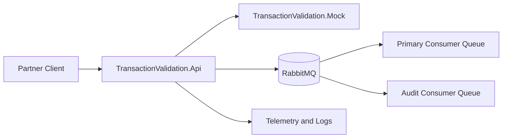
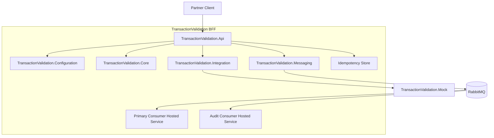
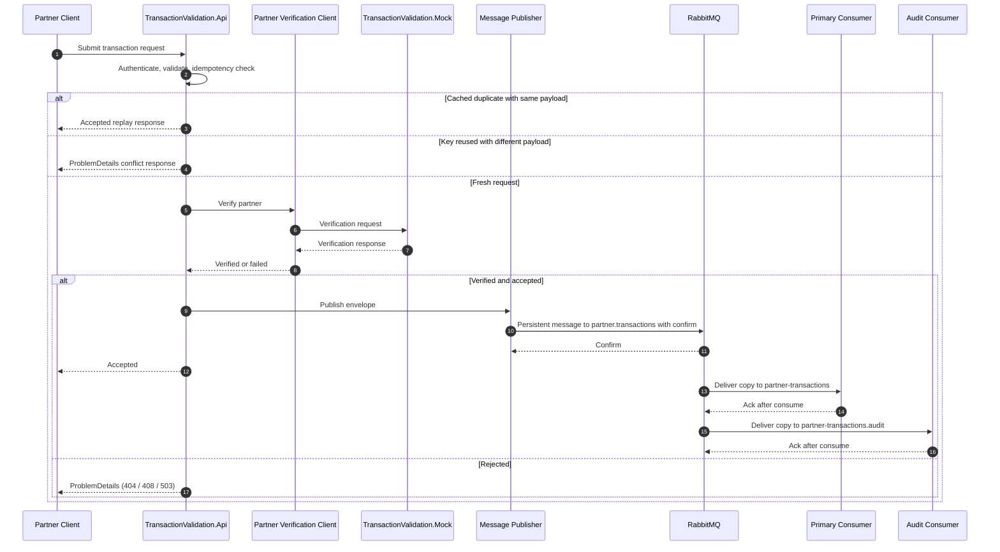

# Architecture Design Overview

This document provides a high-level architecture view of the TransactionValidation BFF. It focuses on how major components collaborate and how the solution is organized, without implementation-level detail.

This design is aligned to:

- [implementation/implementation_scaffold.md](../implementation/implementation_scaffold.md)
- [implementation/implementation_phases.md](../implementation/implementation_phases.md)
- [implementation/implementation_checklist.md](../implementation/implementation_checklist.md)

## 1. Purpose and Scope

The system accepts partner transaction requests, validates them, applies idempotency checks with cached replay for duplicates, verifies partner identity through an external verification endpoint, and publishes accepted transactions once to a durable topic exchange for independent downstream consumers.

Core capabilities:

- Request intake via BFF API
- API key protection
- Validation and idempotency handling
- Partner verification integration
- Asynchronous message publishing
- Asynchronous message consumption
- Operational observability

## 2. System Context

## 3. Component Overview

Responsibilities by project:

- TransactionValidation.Api: API entrypoint, endpoint orchestration, HTTP pipeline.
- TransactionValidation.Configuration: centralized DI, options binding, middleware, exception mapping, telemetry wiring.
- TransactionValidation.Core: domain models, contracts, validation, exceptions.
- TransactionValidation.Integration: partner verification client with resilience policies.
- TransactionValidation.Messaging: exchange publishing abstraction and RabbitMQ implementation.
- TransactionValidation.Mock: local mock provider for partner verification behavior and two hosted RabbitMQ consumers with independent queues.
- TransactionValidation.Tests: unit and integration tests.

## 4. High-Level Runtime Sequence

## 5. Configuration and Deployment View

Configuration precedence is intentionally layered for predictable overrides:

1. appsettings.json
2. appsettings.Environment.json
3. environment variables (including values from `.env` when injected by Docker Compose)
4. command-line arguments

Deployment modes:

- Local process mode: API and Mock run from dotnet tooling.
- Container mode: API, Mock, and RabbitMQ run via docker compose.

## 6. Cross-Cutting Concerns

- Security: API key middleware guards external entrypoints.
- Reliability: outbound verification uses resilience policies; queue publishing expects broker confirm semantics.
- Idempotency: duplicate same-payload requests replay the cached accepted response; same-key different-payload requests fail with conflict.
- Error handling: domain exceptions are mapped to RFC 7807 ProblemDetails through centralized exception handling, including upstream `404 Not Found`, `408 Request Timeout`, and `503 Service Unavailable` categories.
- Observability: structured logging and OpenTelemetry pipeline with optional Azure Monitor export.

## 7. Phase Alignment (Overview)

- Phases 1-2: solution structure, core domain contracts, validators.
- Phases 3-4: configuration and middleware foundation, mock verification service.
- Phases 5-6: integration and messaging implementations, endpoint orchestration, idempotency behavior, and publish-to-consume runtime flow.
- Phases 7-8: observability maturity and quality coverage.
- Phases 9-10: containerization, run documentation, and final readiness review.

## 8. Design Boundaries

This architecture overview is intentionally concise and does not define low-level class internals, exact retry values, or exhaustive API contract examples. Those details belong to implementation and operational documents.
