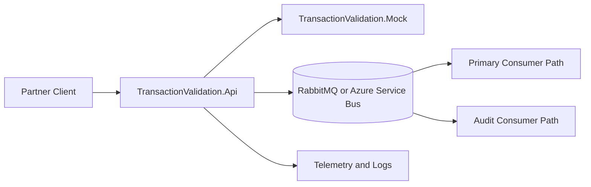
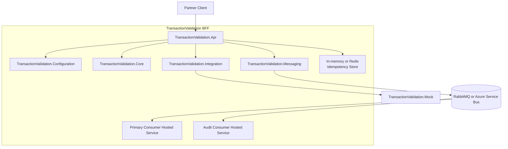
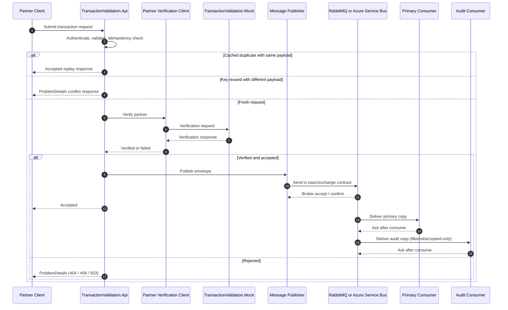

# Architecture Design Overview

This document provides a high-level architecture view of the TransactionValidation BFF. It focuses on how major components collaborate and how the solution is organized, without implementation-level detail.

The current design supports both RabbitMQ and Azure Service Bus as runtime broker implementations. The active broker is selected through `MESSAGING__BROKERTYPE`, while the business flow and consumer model remain consistent across both implementations.

Detailed runtime and host conventions are defined in the [Runtime and API feature](../features/runtime-and-api/README.md).

## 1. Purpose and Scope

The system accepts partner transaction requests, validates them, applies idempotency checks with cached replay for duplicates, verifies partner identity through an external verification endpoint, and publishes accepted transactions once through a broker-native topic or exchange pattern for independent downstream consumers.

Core capabilities:

- Request intake via BFF API
- API key protection
- Validation and idempotency handling
- Partner verification integration
- Asynchronous message publishing
- Asynchronous message consumption
- Operational observability

## 2. System Context

```mermaid
flowchart LR
    Partner[Partner Client] --> API[TransactionValidation.Api]
    API --> Mock[TransactionValidation.Mock]
    API --> Broker[(RabbitMQ or Azure Service Bus)]
    Broker --> Primary[Primary Consumer Path]
    Broker --> Audit[Audit Consumer Path]
    API --> Obs[Telemetry and Logs]
```

## 3. Component Overview

```mermaid
flowchart TB
    subgraph BFF[TransactionValidation BFF]
        Api[TransactionValidation.Api]
        Cfg[TransactionValidation.Configuration]
        Core[TransactionValidation.Core]
        Intg[TransactionValidation.Integration]
        Msg[TransactionValidation.Messaging]
        Primary[Primary Consumer Hosted Service]
        Audit[Audit Consumer Hosted Service]
        Idem[In-memory or Redis<br/>Idempotency Store]
    end

    Partner[Partner Client] --> Api
    Api --> Cfg
    Api --> Core
    Api --> Intg
    Api --> Msg
    Api --> Idem

    Intg --> Mock[TransactionValidation.Mock]
    Msg --> Broker[(RabbitMQ or Azure Service Bus)]
    Broker --> Primary
    Broker --> Audit
```

Responsibilities by project:

| Project | Responsibility |
|---|---|
| `TransactionValidation.Api` | Public HTTP host, endpoint orchestration, broker composition, idempotency-store selection, Swagger, and API health checks. |
| `TransactionValidation.Configuration` | Shared configuration loading, dependency registration, middleware, exception mapping, resilience, telemetry, and broker-selection support. |
| `TransactionValidation.Core` | Runtime-neutral request and message models, contracts, validation, exceptions, and logging catalogs. |
| `TransactionValidation.Integration` | Partner-verification HTTP adapter and upstream outcome translation. |
| `TransactionValidation.Messaging` | Broker-neutral publication support and RabbitMQ/Azure Service Bus publisher adapters. |
| `TransactionValidation.Mock` | Mock partner-verification host plus independent primary and audit consumers for the active broker. |
| `TransactionValidation.Tests` | Unit, integration-host, and broker-backed end-to-end verification. |

Project dependencies flow toward the shared contracts:

- `Core` has no project references.
- `Integration` and `Messaging` reference `Core`.
- `Configuration` references `Core`, `Integration`, and `Messaging` to provide shared registration.
- `Api` references `Configuration`, `Core`, `Integration`, and `Messaging` as its composition root.
- `Mock` references `Configuration` and `Messaging` for shared host setup and consumer infrastructure.
- `Tests` reference the projects whose public behavior they verify.

## 4. High-Level Runtime Sequence

```mermaid
sequenceDiagram
    autonumber
    participant Client as Partner Client
    participant API as TransactionValidation.Api
    participant Verify as Partner Verification Client
    participant Mock as TransactionValidation.Mock
    participant Publish as Message Publisher
    participant Broker as RabbitMQ or Azure Service Bus
    participant Primary as Primary Consumer
    participant Audit as Audit Consumer

    Client->>API: Submit transaction request
    API->>API: Authenticate, validate, idempotency check

    alt Cached duplicate with same payload
        API-->>Client: Accepted replay response
    else Key reused with different payload
        API-->>Client: ProblemDetails conflict response
    else Fresh request
        API->>Verify: Verify partner
        Verify->>Mock: Verification request
        Mock-->>Verify: Verification response
        Verify-->>API: Verified or failed

        alt Verified and accepted
            API->>Publish: Publish envelope
            Publish->>Broker: Send to topic/exchange contract
            Broker-->>Publish: Broker accept / confirm
            API-->>Client: Accepted
            Broker->>Primary: Deliver primary copy
            Primary-->>Broker: Ack after consume
            Broker->>Audit: Deliver audit copy (filtered/accepted-only)
            Audit-->>Broker: Ack after consume
        else Rejected
            API-->>Client: ProblemDetails (404 / 408 / 503)
        end
    end
```

## 5. Configuration and Deployment View

Configuration precedence is intentionally layered for predictable overrides:

1. appsettings.json
2. appsettings.Environment.json
3. local `.env` values when a process value is not already set
4. process or container environment variables
5. command-line arguments

Deployment modes:

- Local process mode: API and Mock run from dotnet tooling.
- Container mode: API, Mock, and the active broker run via docker compose.
- Azure mode: API and Mock run in Azure Container Apps with managed messaging and distributed idempotency services.
- Broker selection: `MESSAGING__BROKERTYPE` chooses the active topology; RabbitMQ remains the local default while Azure Service Bus is the Azure-native mode.

## 6. Cross-Cutting Concerns

- Security: API key middleware guards external entrypoints.
- Reliability: outbound verification uses resilience policies; broker publishing expects native broker confirmation semantics.
- Idempotency: duplicate same-payload requests replay the cached accepted response; same-key different-payload requests fail with conflict. The in-memory store is the single-process fallback, while Redis shares state across API replicas.
- Error handling: domain exceptions are mapped to RFC 7807 ProblemDetails through centralized exception handling, including upstream `404 Not Found`, `408 Request Timeout`, and `503 Service Unavailable` categories.
- Observability: structured logging and OpenTelemetry pipeline with optional Azure Monitor export.
- Broker neutrality: runtime selection keeps the business flow stable regardless of whether the active implementation is RabbitMQ or Azure Service Bus.

## 7. Design Boundaries

This architecture overview is intentionally concise and does not define low-level class internals, exact retry values, exhaustive API contract examples, or operational procedures. Those details belong to feature documents and runbooks.
