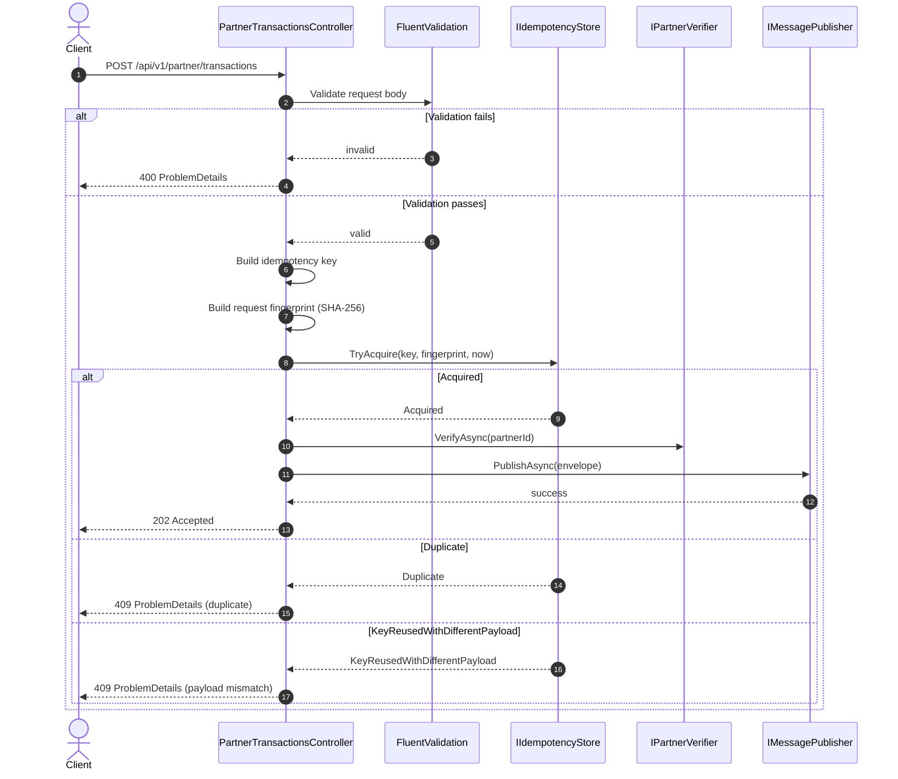

# API Idempotency Flow and Semantics

## Scope

This document describes the idempotency mechanism for:
- `POST /api/v1/partner/transactions`
- Controller: `PartnerTransactionsController.CreateAsync`
- In-memory store: `IIdempotencyStore` and `InMemoryIdempotencyStore`

It explains request-to-response behavior for:
- happy path
- duplicate replay
- same key with different payload
- validation/security/integration failure paths

---

## Objectives

The idempotency mechanism exists to:
- prevent duplicate processing within a bounded window
- detect replay attempts where a client reuses the same key but changes request payload
- keep behavior deterministic under retries and network uncertainty

Current implementation target:
- in-memory, single-process dedupe (demo and local flow)
- configurable dedupe window (`Idempotency:WindowMinutes`, clamped to 10-15)
- upgrade path to durable distributed storage (for multi-instance production)

---

## End-to-End Flow (Request to Response)



---

## Key Construction and Fingerprint Semantics

### 1) Idempotency key material

The controller builds a logical key as:
- If header `Idempotency-Key` exists and is not empty:
  - `partnerId|idempotencyHeader`
- Else:
  - `partnerId|transactionReference`

Notes:
- `partnerId`, header value, and `transactionReference` are trimmed.
- Partner scope is included to reduce cross-partner collisions.

### 2) Request fingerprint

A canonical payload string is generated from:
- `partnerId` (trimmed)
- `transactionReference` (trimmed)
- `amount` (invariant numeric format)
- `currency` (uppercased)
- `timestamp` (UTC, round-trip ISO format)

Then:
- SHA-256 hash is computed
- hex string is passed to the store as `requestFingerprint`

### 3) Cache key encoding

In the in-memory store, the logical key is hashed (SHA-256 hex) before dictionary usage.
This avoids storing raw key material in cache.

---

## Store Acquire Results

`IIdempotencyStore.TryAcquire` returns one of:

- `Acquired`
- `Duplicate`
- `KeyReusedWithDifferentPayload`

### Decision logic in store

Given `(key, fingerprint, now)`:

1. If no active entry for key:
- add `(expiresAt, fingerprint)`
- return `Acquired`

2. If active entry exists and fingerprint matches:
- return `Duplicate`

3. If active entry exists and fingerprint differs:
- return `KeyReusedWithDifferentPayload`

4. If entry exists but is expired:
- remove expired entry
- retry acquisition

TTL cleanup is performed periodically (every 128 acquire calls) plus lazy expiration checks on access.

---

## Response Semantics

### Success

- Condition:
  - request valid
  - idempotency acquire = `Acquired`
  - partner verification succeeds
  - publish succeeds
- Response:
  - `202 Accepted`
  - payload includes `messageId`, `correlationId`, `status`

### Conflict: duplicate replay

- Condition:
  - same key reused within TTL
  - same fingerprint
- Response:
  - `409 Conflict` via ProblemDetails
  - message: duplicate transaction detected

### Conflict: key reused with different payload

- Condition:
  - same key reused within TTL
  - different fingerprint
- Response:
  - `409 Conflict` via ProblemDetails
  - message: key already used with different payload

### Validation failure

- Condition:
  - validator rejects request
- Response:
  - `400 Bad Request` via ProblemDetails

### Security failure

- Condition:
  - missing/invalid API key (middleware)
- Response:
  - `401 Unauthorized`

### Partner verification failure

- Condition:
  - partner verify returns non-success and client throws domain exception
- Response:
  - `404 Not Found` via ProblemDetails

### Publish confirm failure

- Condition:
  - message publisher throws conflict on missing broker confirm
- Response:
  - `409 Conflict` via ProblemDetails

### Unexpected runtime failure

- Condition:
  - unhandled exception
- Response:
  - `500 Internal Server Error` via ProblemDetails

---

## Release-on-Failure Policy

If processing fails after key acquisition (verification/publish/other exception), controller calls:
- `Release(idempotencyKey)`

Effect:
- request may be retried immediately with same key
- avoids long false locks for failed attempts

Current trade-off:
- this favors retryability over strict replay locking of failures.
- for production-grade behavior, consider storing final operation status and replaying same response for same key.

---

## Happy Case Walkthrough

1. Client sends valid transaction with `Idempotency-Key`.
2. Controller validates request.
3. Controller builds key and payload fingerprint.
4. Store acquires key (`Acquired`) and stores fingerprint with TTL.
5. Partner verification succeeds.
6. Envelope is published and confirmed.
7. API returns `202 Accepted`.
8. Any immediate retried request with same key+payload returns `409 Duplicate` until TTL expires.

---

## Edge Cases Matrix

| Case | Example | Outcome |
|---|---|---|
| Same key, same payload, within TTL | Retry due to client timeout | `409 Duplicate` |
| Same key, different payload, within TTL | Client mutates amount/currency/timestamp | `409 Conflict` (payload mismatch) |
| No `Idempotency-Key` header | Fallback to `partnerId|transactionReference` | Normal idempotency behavior |
| Same transactionReference under different partnerId | Multi-tenant collisions | isolated by partner scope |
| Expired key beyond TTL | replay after window | treated as new request (`Acquired`) |
| Failure after acquire | verifier/publisher exception | key released, retry allowed |
| Concurrent duplicate requests | race on same key | single acquire winner; others conflict |

---

## Configuration

`IdempotencyOptions` binds from section:

```json
"Idempotency": {
  "WindowMinutes": 15
}
```

Runtime behavior:
- configured value is clamped to `10..15` minutes
- default is 15 when not provided

---

## Security and Policy Notes

Current controls:
- raw key is not stored directly in the dictionary (encoded key used)
- payload mismatch detection is explicit
- partner scoping is embedded in key material

Recommended next hardening:
- add key length limits and character-policy validation on `Idempotency-Key`
- return explicit ProblemDetails error codes for duplicate vs mismatch
- persist idempotency state in durable storage (Redis/DB) for multi-instance deployments
- optionally store/replay final response for strict idempotency semantics

---

## Related Implementation Files

- `src/TransactionValidation.Api/Controllers/PartnerTransactionsController.cs`
- `src/TransactionValidation.Api/Idempotency/IIdempotencyStore.cs`
- `src/TransactionValidation.Api/Idempotency/InMemoryIdempotencyStore.cs`
- `src/TransactionValidation.Api/Program.cs`
- `src/TransactionValidation.Configuration/Options/IdempotencyOptions.cs`
