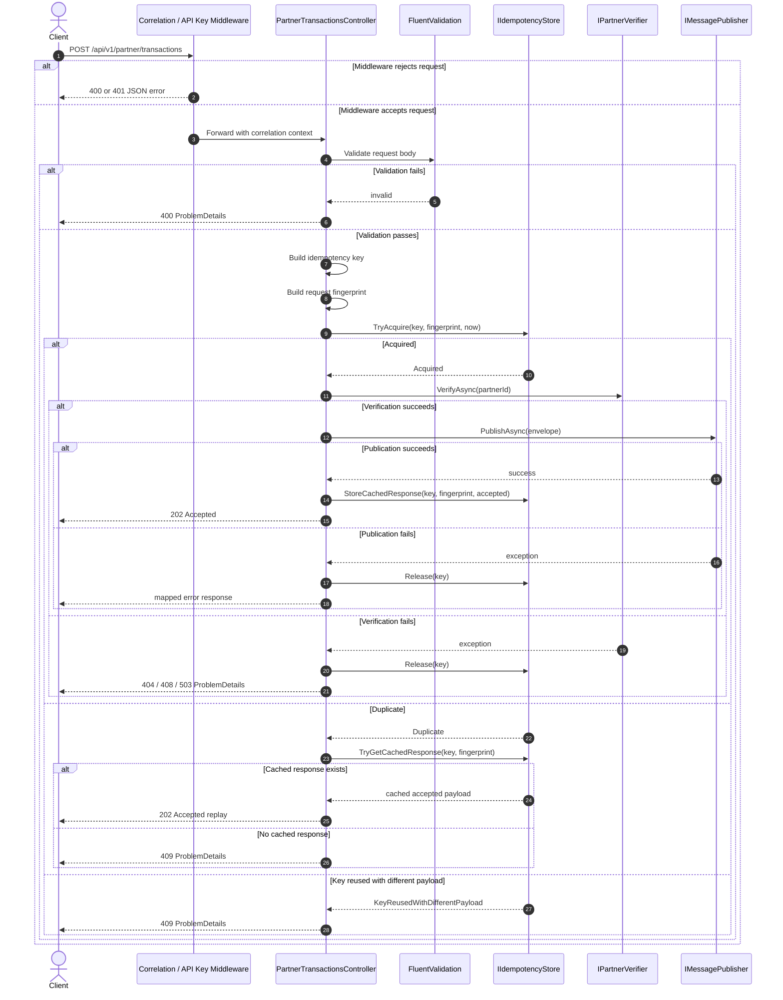

# API Idempotency Flow and Semantics

Status: Active architecture reference

This document is the authoritative semantic reference for request idempotency in TransactionValidation. It defines the end-to-end contract for request identity, replay handling, response replacement, store behavior, and release semantics.

## Scope

This document covers:

- `POST /api/v1/partner/transactions`
- `PartnerTransactionsController.CreateAsync`
- `IIdempotencyStore`
- `InMemoryIdempotencyStore`
- `RedisIdempotencyStore`
- `IdempotencyStoreRegistration`

It explains the rules for:

- carried request identity
- duplicate detection within the idempotency window
- same-key/different-payload conflict handling
- in-memory vs Redis behavior
- response replay and replacement semantics
- release-after-failure behavior
- the distinction between request replay and downstream business success

---

## Objectives

The idempotency mechanism exists to guarantee that the same client intent does not result in repeated business processing within a bounded retry window.

The current model enforces four core invariants:

1. the same logical request key can be retried safely
2. the same logical key with a different payload is rejected as a contract conflict
3. a successful accepted response can be replayed for the same key and payload during the TTL window
4. failed attempts do not keep a stale lock longer than necessary

In practice:

- empty `Redis:ConnectionString` selects the local in-memory store
- configured `Redis:ConnectionString` selects the distributed Redis-backed store
- `Idempotency:WindowMinutes` is clamped to a bounded range and determines the replay window
- successful accepted responses are cached and replayed in both store modes

---

## Architecture ownership

This document owns the semantic contract for idempotency.

It is intentionally separate from:

- the system overview in [Architecture_design.md](Architecture_design.md)
- the broker topology in [messaging_topology_and_consumer_routing.md](messaging_topology_and_consumer_routing.md)
- operational deployment and runbooks in [../operations](../operations/README.md)

The idempotency semantics belong to the core runtime contract, not to the deployment layer.

---

## End-to-end lifecycle

```mermaid
sequenceDiagram
    autonumber
    actor Client
    participant Middleware as Correlation / API Key Middleware
    participant API as PartnerTransactionsController
    participant Validator as FluentValidation
    participant Store as IIdempotencyStore
    participant Verifier as IPartnerVerifier
    participant Publisher as IMessagePublisher

    Client->>Middleware: POST /api/v1/partner/transactions
    alt Middleware rejects request
        Middleware-->>Client: 400 or 401 JSON error
    else Middleware accepts request
        Middleware->>API: Forward with correlation context
        API->>Validator: Validate request body
        alt Validation fails
            Validator-->>API: invalid
            API-->>Client: 400 ProblemDetails
        else Validation passes
            API->>API: Build idempotency key
            API->>API: Build request fingerprint
            API->>Store: TryAcquire(key, fingerprint, now)

            alt Acquired
                Store-->>API: Acquired
                API->>Verifier: VerifyAsync(partnerId)
                alt Verification succeeds
                    API->>Publisher: PublishAsync(envelope)
                    alt Publication succeeds
                        Publisher-->>API: success
                        API->>Store: StoreCachedResponse(key, fingerprint, accepted)
                        API-->>Client: 202 Accepted
                    else Publication fails
                        Publisher-->>API: exception
                        API->>Store: Release(key)
                        API-->>Client: mapped error response
                    end
                else Verification fails
                    Verifier-->>API: exception
                    API->>Store: Release(key)
                    API-->>Client: 404 / 408 / 503 ProblemDetails
                end
            else Duplicate
                Store-->>API: Duplicate
                API->>Store: TryGetCachedResponse(key, fingerprint)
                alt Cached response exists
                    Store-->>API: cached accepted payload
                    API-->>Client: 202 Accepted replay
                else No cached response
                    API-->>Client: 409 ProblemDetails
                end
            else Key reused with different payload
                Store-->>API: KeyReusedWithDifferentPayload
                API-->>Client: 409 ProblemDetails
            end
        end
    end
```

---

## 1. Request identity model

The system defines a logical request identity as a tuple of:

- partner scope
- idempotency key or request reference
- canonical request payload fingerprint

### 1.1 Idempotency key construction

The controller builds the logical key as:

- if `Idempotency-Key` header exists and is not empty: `partnerId|idempotencyHeader`
- otherwise: `partnerId|transactionReference`

This keeps the idempotency scope aligned with the partner and avoids cross-partner collisions.

### 1.2 Canonical fingerprint

The payload fingerprint is derived from canonicalized fields such as:

- `partnerId`
- `transactionReference`
- numeric amount in a normalized format
- `currency` normalized to canonical casing
- timestamp normalized to a stable UTC representation

The resulting fingerprint is a SHA-256 hex string. Identity is therefore based on both key reuse and payload equivalence, not on the raw request body alone.

### 1.3 Store key encoding

The logical key is transformed before storage. Both stores hash the logical key as a stable SHA-256 value before writing dictionary or Redis entries. This prevents raw client-supplied values from becoming the definitive storage identity.

---

## 2. Idempotency decision rules

`IIdempotencyStore.TryAcquire` returns one of:

- `Acquired`
- `Duplicate`
- `KeyReusedWithDifferentPayload`

The decision is deterministic:

1. If no existing entry exists for the key, create one and return `Acquired`.
2. If an entry exists and the fingerprint matches, return `Duplicate`.
3. If an entry exists and the fingerprint differs, return `KeyReusedWithDifferentPayload`.
4. If the entry has expired, the next request may reacquire it.

This is the core contract that prevents duplicate processing while still detecting malicious or accidental key reuse with a different payload.

---

## 3. Store model comparison

| Concern | In-memory store | Redis-backed store |
|---|---|---|
| Scope | process-local | shared across API instances |
| Concurrency | thread-safe dictionary | Redis atomic reservation with TTL |
| Expiry | lazy expiry + periodic cleanup | Redis TTL expiration |
| Replay | local cached accepted response | Redis cached accepted response |
| Failure domain | single process | multi-instance and multi-replica |
| Winner of race | first in-process acquisition | first atomic Redis reservation |

### 3.1 In-memory behavior

The in-memory store uses a concurrent dictionary and an expiry-check path. It is intentionally simple and appropriate for single-node local or test execution.

It does not protect against multi-instance duplicates. That is why the Redis-backed store exists for a shared runtime environment.

### 3.2 Redis behavior

The Redis-backed store uses atomic reservation semantics with a TTL so that multiple API instances cannot both claim the same key. This provides stronger cross-process safety for duplicate requests arriving simultaneously.

The Redis store stores:

- reservation metadata keyed by a hashed request key
- a fingerprint value to assess same-payload vs payload-conflict semantics
- a cached accepted response for replaying successful results

---

## 4. Response replacement semantics

The system must distinguish between a new accepted result and a replay of an already accepted result.

### 4.1 Successful first attempt

A request is treated as accepted when all of the following succeed:

- request validated
- idempotency key acquired
- partner verification succeeds
- message publish succeeds

The controller stores the accepted response and returns `202 Accepted`.

### 4.2 Same key, same payload replay

A later request with the same logical key and matching fingerprint is treated as a replay.

The controller returns the cached accepted response instead of re-processing the message. The response is semantically the same as the original result:

- same `messageId`
- same `correlationId`
- same status

This is the replacement behavior for request retries due to network uncertainty or client timeout.

### 4.3 Same key, different payload conflict

A later request with the same logical key but a different fingerprint is rejected as a contract conflict.

This preserves deterministic semantics and prevents one payload variant from silently replacing another intentionally different request under the same key.

The response is `409 Conflict` and indicates the key has already been used for a different payload.

### 4.4 Cache-miss fallback

If a duplicate request is detected but the accepted response cache is missing, the system returns `409 Conflict` rather than pretending the previous request succeeded. This is a fail-safe guard that avoids replaying unproven results.

---

## 5. Failure and release semantics

The idempotency key is acquired before expensive operations such as partner verification and message publication. If a later step fails, the key must be released so the system can retry without a stale lock.

### 5.1 Release-after-failure behavior

When verification or publication throws, the controller releases the key. This means:

- the request may safely be retried by the client
- the key does not remain locked for the TTL window after an unsuccessful outcome
- only successful accepted responses are replayed

### 5.2 No replay of failed attempts

A failed request is not replaced with a cached success response. Failed outcomes are never replayed as though they were accepted work.

### 5.3 Limits of the guarantee

This mechanism protects against duplicate request execution at the API layer. It does not guarantee that downstream external side effects are themselves deduplicated. Consumer-side idempotency remains a separate concern if a later processing stage performs non-idempotent writes.

---

## 6. Expiry and TTL behavior

The idempotency TTL is configured through `IdempotencyOptions` and bounded to a practical range. Within that window:

- the same key and fingerprint are treated as a replay
- the accepted response may be reused
- the same key with a different payload is treated as a conflict

Outside that window:

- the key is considered expired
- a new request may acquire the key again

This makes the replay semantics bounded and deterministic, while still allowing safe retry windows after a successful accepted outcome.

---

## 7. Complete decision matrix

| Condition | Result |
|---|---|
| no existing key | `Acquired` |
| existing key + same fingerprint | `Duplicate` |
| existing key + different fingerprint | `KeyReusedWithDifferentPayload` |
| validation failure before acquire | `400 Bad Request` |
| invalid API key | `401 Unauthorized` |
| correlation-id invalid | `400 Bad Request` |
| partner verification fails | mapped domain error |
| message publication fails after acquire | key released; mapped error |
| successful accepted response exists within TTL | replay `202 Accepted` |
| expired key beyond TTL | request may re-enter as a new acquire |

---

## 8. Security and correctness boundaries

The current model has the following explicit guards:

- logical key is not used directly as the final persisted storage identity
- payload mismatch is enforced with a fingerprint comparison
- partner scope is included in the logical key
- successful accepted responses are cached, not failed or speculative ones
- API-level replay is bounded and never substitutes for durable consumer-side deduplication

The current design does not attempt to fully deduplicate every downstream side effect; it guarantees consistent request-level behavior at the API boundary.

---

## 9. Related implementation files

- `src/TransactionValidation.Api/Controllers/PartnerTransactionsController.cs`
- `src/TransactionValidation.Api/Idempotency/IIdempotencyStore.cs`
- `src/TransactionValidation.Api/Idempotency/InMemoryIdempotencyStore.cs`
- `src/TransactionValidation.Api/Idempotency/RedisIdempotencyStore.cs`
- `src/TransactionValidation.Api/Idempotency/IdempotencyStoreRegistration.cs`
- `src/TransactionValidation.Configuration/Options/IdempotencyOptions.cs`
- `src/TransactionValidation.Configuration/Options/RedisOptions.cs`

## Related documentation

- [Architecture_design.md](Architecture_design.md)
- [messaging_topology_and_consumer_routing.md](messaging_topology_and_consumer_routing.md)
- [../features/distributed-state/README.md](../features/distributed-state/README.md)
- [../features/validation-and-security/README.md](../features/validation-and-security/README.md)
- [../features/runtime-and-api/README.md](../features/runtime-and-api/README.md)
