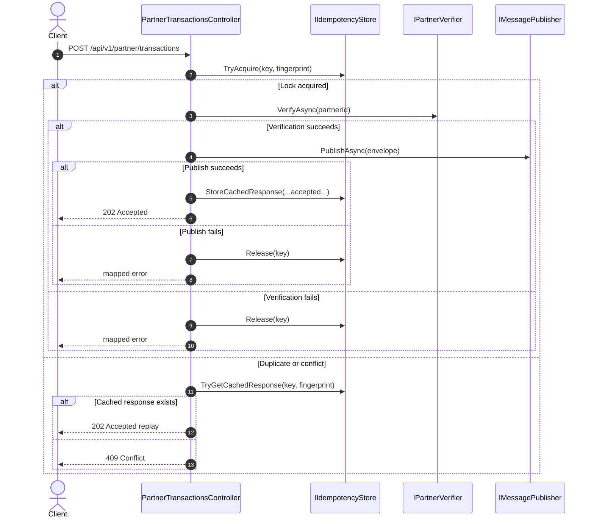

# Failure, Timeout, and Retry Flow

Status: Active architecture reference

This document covers the recovery and re-entry behavior of the request lifecycle. It complements the data-contract semantics in [api_idempotency_flow_and_semantics.md](api_idempotency_flow_and_semantics.md) by describing what happens when requests fail, time out, or are retried after a partial outcome.

## Scope

This document covers:

- timeout handling during request replay
- partner verification exceptions and downstream failure mapping
- publisher errors and broker confirmation issues
- release-after-failure semantics
- retry windows and idempotency re-entry behavior
- when a request should be retried versus rejected
- the distinction between request-level replay and downstream non-idempotent work

---

## Core principle

The idempotency contract is designed to protect the API boundary from duplicate execution. It is not a guarantee that every downstream side effect is automatically deduplicated.

In other words:

- a successful request may be replayed safely within the replay window
- a failed request should not occupy the key beyond the failure window
- a retry should be treated as a fresh attempt only after the failed attempt is released and the state is cleared

---

## Failure flow overview

---

## 1. Timeout semantics

A client timeout does not mean the request was not accepted by the API. The decisive factor is whether the request reached the idempotency decision step and whether the accepted response was cached.

If the client times out after the API accepted the request but before receiving the response:

- the same key and payload may be retried safely
- the API returns the cached accepted response when the same request is replayed within the TTL window
- the response is treated as replayed success, not as a second processing attempt

This is the main reason the replay window is bounded and the accepted response is cached.

---

## 2. Retry and re-entry behavior

A retry is only safe when the request is identical to the one already accepted or when the prior failed attempt has been released.

### 2.1 Safe retry

Safe retry conditions:

- same key and same fingerprint
- accepted response already cached and within TTL
- previous attempt failed after the client timed out but before receiving a response

This results in replay of the accepted response.

### 2.2 Unsafe retry

Unsafe retry conditions:

- same key but different payload
- same payload but no accepted-response cache
- request arrives after key expiry

These scenarios must not be silently treated as safe replays.

---

## 3. Release-after-failure policy

After a non-successful branch such as validation failure, verification failure, or publish failure, the idempotency key is released if it was previously acquired.

This is essential because it prevents a failure from leaving a stale lock behind and blocking legitimate retries.

### 3.1 Failure cases that release state

The current implementation releases the key when:

- partner verification throws or returns a failing result
- publish fails or cannot confirm acceptance
- unexpected runtime exception occurs during the accepted-processing path

### 3.2 Failure cases that do not replay success

A failure path does not create a cached accepted response. If the request is retried later, it must go through the normal acquisition flow again.

---

## 4. Timeout and exception matrix

| Failure condition | Idempotency state | API behavior | Retry expectation |
|---|---|---|---|
| Client timeout after accept | accepted and cached | replay cached `202 Accepted` on same key/payload | safe to retry |
| Partner verify exception | key released | mapped error response | retry may re-enter as fresh attempt |
| Publish confirmation failure | key released | mapped error response | retry as fresh attempt |
| Validation failure | no acquire in normal path | `400 Bad Request` | not a replay condition |
| Same key, different payload | key still reserved | `409 Conflict` | not safe to retry with changed payload |
| Expired key | state expired | request may reacquire | fresh attempt allowed |

---

## 5. Response replacement rules during failure

The system distinguishes between:

- response replacement for a previously accepted, successful request
- response mapping for a failed or rejected request

The key rules are:

- accepted success may be replayed from cache
- failed outcomes are not replayed as success
- conflict outcomes remain conflict outcomes
- no retry should convert a failed result into a cached success without a successful prior acceptance

This keeps the semantics deterministic and prevents a retried failure from masquerading as an accepted business result.

---

## 6. Redis, in-memory, and failure behavior

The same failure semantics apply in both store modes, but the failure domain differs:

- in-memory mode: failures are local to a single process
- Redis mode: failures are shared across multiple API instances and replicas

This means the same retry rule remains true even when the state store changes:

- success can be replayed within the TTL window
- failure releases the entry and allows re-entry
- no stale accepted result is replayed without a valid prior success

---

## 7. Operational boundaries

This document is architectural, not procedural.

It does not describe:

- deployment runbooks
- monitoring dashboards
- operational diagnostics
- local development startup flows

Those belong to the operational docs layer. This document explains the contract for what is safe to retry and what must fail fast.

---

## 8. Key correctness rules

The following rules are mandatory:

1. Failures do not preserve a stale successful replay entry unless the original request actually succeeded.
2. Same key + same payload within TTL is replay-safe for accepted responses.
3. Same key + different payload is a contract conflict and must not be silently replaced.
4. A request that has not been accepted should not be treated as replay success.
5. The key release path is critical to safe retry behavior.

---

## Related documentation

- [api_idempotency_flow_and_semantics.md](api_idempotency_flow_and_semantics.md)
- [messaging_topology_and_consumer_routing.md](messaging_topology_and_consumer_routing.md)
- [Architecture_design.md](Architecture_design.md)
- [../features/distributed-state/README.md](../features/distributed-state/README.md)
- [../features/reliability/README.md](../features/reliability/README.md)
