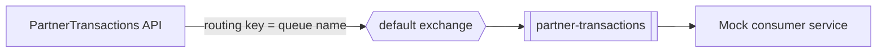
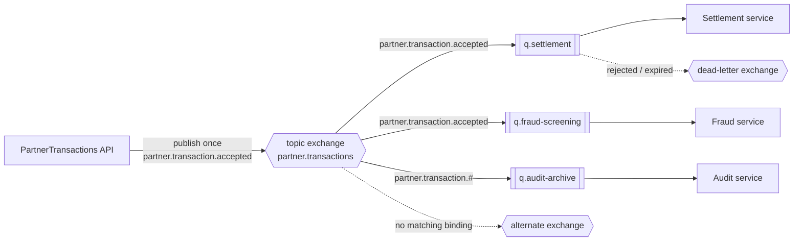

# Messaging Topology and Consumer Routing

Scope: how accepted partner transactions are routed from the API to downstream consumers, covering the current default-exchange approach (legacy) and the planned exchange-based approach that supports multiple consumers.

Related documents:

- Primary architecture overview: [Architecture_design.md](Architecture_design.md)
- Idempotency semantics: [api_idempotency_flow_and_semantics.md](api_idempotency_flow_and_semantics.md)

---

## 1. Why this document exists

The current implementation publishes to a single named queue. That works for one consumer, but every additional downstream service would require the API to know about that service and publish to it explicitly.

This document records the current behavior as the legacy baseline and defines the target topology so the transition is intentional rather than incremental.

---

## 2. Current approach (legacy): default exchange, single queue

### 2.1 Behavior

The publisher sends messages to the AMQP **default exchange** using the queue name as the routing key. With the default exchange, a message published with routing key `X` is delivered to the queue named `X`.

Implementation references:

- Publisher: [../../src/TransactionValidation.Messaging/RabbitMqMessagePublisher.cs](../../src/TransactionValidation.Messaging/RabbitMqMessagePublisher.cs)
- Adapter: [../../src/TransactionValidation.Messaging/RabbitMqClientAdapter.cs](../../src/TransactionValidation.Messaging/RabbitMqClientAdapter.cs)
- Adapter contract: [../../src/TransactionValidation.Messaging/IRabbitMqClientAdapter.cs](../../src/TransactionValidation.Messaging/IRabbitMqClientAdapter.cs)
- Options: [../../src/TransactionValidation.Configuration/Options/RabbitMqOptions.cs](../../src/TransactionValidation.Configuration/Options/RabbitMqOptions.cs)

### 2.2 Flow



### 2.3 Characteristics

| Aspect | Current state |
|---|---|
| Exchange | Default exchange (empty name) |
| Routing key | Equals the target queue name |
| Topology owner | Publisher declares the consumer queue |
| Consumer model | Point-to-point, effectively one logical consumer |
| Queue declaration | Performed on every publish call |
| Adding a consumer | Requires publisher/API change |

### 2.4 Limitations

1. **Publisher knows its subscribers.** The API must be configured with the destination queue, so downstream topology leaks into the producing service.
2. **No fan-out path.** A second consumer either shares the same queue and competes for messages, or requires a second explicit publish.
3. **Topology ownership is inverted.** The publisher declares a queue that a different service consumes, which couples deployment of the two.
4. **Per-publish declaration overhead.** Queue declaration is repeated on each publish rather than performed once.

Limitation 1 and 3 are the architectural blockers. Limitation 4 is a performance concern tracked separately.

---

## 3. Target approach: topic exchange with consumer-owned queues

### 3.1 Principle

The API publishes **one** message to an exchange and does not know who consumes it. Each consumer owns its queue and binds it to the exchange with a routing pattern that expresses its interest.

### 3.2 Topology



### 3.3 Why topic rather than fanout

A fanout exchange delivers every message to every bound queue, which pushes filtering into consumer code. A topic exchange keeps selection in the broker, so a consumer that only cares about accepted transactions never receives unverified ones.

Fanout remains acceptable if every consumer genuinely needs every message, but topic is the safer default because it does not require re-architecting when the first selective consumer appears.

### 3.4 Routing key convention

```text
partner.transaction.accepted
partner.transaction.unverified
```

Format: `partner.transaction.<outcome>`

The routing key is derived inside the Messaging project from the envelope, not supplied by the caller. This keeps routing decisions in one place and prevents controllers from constructing broker-specific strings.

### 3.5 Topology ownership

| Object | Owner | Rationale |
|---|---|---|
| Exchange | Publisher (API) | The producer defines the contract surface it publishes to |
| Queue | Each consumer | A queue is an implementation detail of the consuming service |
| Binding | Each consumer | Interest is declared by the party that has the interest |
| Dead-letter queue | Each consumer | Failure handling is per-consumer |

This split is what allows a new consumer to be added without changing or redeploying the API.

---

## 4. Required changes in the Messaging project

### 4.1 Options

Replace publish-side queue configuration with exchange configuration.

```csharp
public sealed class RabbitMqOptions
{
    public const string SectionName = "RabbitMq";

    public string HostName { get; init; } = "localhost";
    public int Port { get; init; } = 5672;
    public string UserName { get; init; } = "guest";
    public string Password { get; init; } = "guest";

    public string ExchangeName { get; init; } = "partner.transactions";
    public string ExchangeType { get; init; } = "topic";
    public bool Durable { get; init; } = true;

    public string RoutingKeyPrefix { get; init; } = "partner.transaction";
}
```

`QueueName` is retained only if the API hosts a local consumer; it is no longer part of the publish path.

### 4.2 Adapter contract

```csharp
public interface IRabbitMqClientAdapter
{
    Task DeclareExchangeAsync(string exchangeName, string exchangeType, bool durable, CancellationToken cancellationToken = default);

    Task<bool> PublishPersistentWithConfirmAsync(
        string exchangeName,
        string routingKey,
        string payload,
        IReadOnlyDictionary<string, object> headers,
        CancellationToken cancellationToken = default);
}
```

Queue declaration may remain on the interface for consumer-side and test usage, but it is removed from the publish path.

### 4.3 Routing key resolution

```csharp
public interface IMessageRoutingKeyResolver
{
    string Resolve(TransactionEnvelope envelope);
}
```

Future routing dimensions (partner tier, currency, amount band) are added here rather than in the controller or publisher.

### 4.4 Exchange declaration timing

Exchange declaration moves from per-publish to one-time startup initialization, since exchange declaration is idempotent and does not need to run per message.

### 4.5 Unchanged components

| Component | Change required |
|---|---|
| [../../src/TransactionValidation.Core/Interfaces/IMessagePublisher.cs](../../src/TransactionValidation.Core/Interfaces/IMessagePublisher.cs) | None |
| [../../src/TransactionValidation.Api/Controllers/PartnerTransactionsController.cs](../../src/TransactionValidation.Api/Controllers/PartnerTransactionsController.cs) | None |
| Validation, idempotency, partner verification | None |

Core stays transport-agnostic: exchanges and routing keys never appear in `IMessagePublisher`.

---

## 5. Message contract

Once more than one consumer exists, the envelope becomes a published contract.

Published headers:

| Header | Purpose |
|---|---|
| `message-type` | Logical event name for consumer dispatch |
| `message-version` | Contract version for compatibility checks |
| `correlation-id` | End-to-end tracing across services |
| `message-id` | Consumer-side deduplication key |

Compatibility rules:

- Adding optional fields is allowed.
- Renaming or removing fields is a breaking change and requires a version increment.
- Consumers must ignore unknown fields.

Envelope definition: [../../src/TransactionValidation.Core/Models/TransactionEnvelope.cs](../../src/TransactionValidation.Core/Models/TransactionEnvelope.cs)

---

## 6. Delivery semantics and failure handling

### 6.1 Delivery guarantee

Publisher confirms plus consumer retries produce **at-least-once** delivery. Consumers must therefore deduplicate using `message-id`. This mirrors the API-side idempotency model described in [api_idempotency_flow_and_semantics.md](api_idempotency_flow_and_semantics.md).

### 6.2 Publisher confirms do not guarantee consumption

A publisher confirm means the broker accepted the message. It does not mean any queue received it. If a routing key matches no binding, the message is discarded silently while the publish still reports success.

An **alternate exchange** is therefore required so unroutable messages are captured and surfaced instead of lost.

### 6.3 Per-consumer isolation

Each consumer queue has its own dead-letter exchange so that one failing consumer does not block others. A shared queue would couple the failure modes of independent services.

---

## 7. Migration path

The transition is designed so the existing consumer is unaffected.

| Step | Action | Effect on existing consumer |
|---|---|---|
| 1 | Declare the topic exchange | None |
| 2 | Bind `partner-transactions` to the exchange with `partner.transaction.#` | None |
| 3 | Switch the publisher to exchange-based publishing | None; messages still arrive |
| 4 | Verify the existing queue drains normally | Validation step |
| 5 | Onboard new consumers by adding queues and bindings | None |
| 6 | Remove the legacy binding when unused | Legacy path retired |

Step 2 is the compatibility mechanism: the existing consumer continues to read from the same queue and cannot observe the change.

---

## 8. Design constraints

The following are explicitly out of scope for the target design:

1. **No per-consumer publisher implementations.** Registering one publisher per downstream service reintroduces producer-to-consumer coupling.
2. **No publisher-side list of target queues.** Iterating over destinations in the API restores the same limitation the exchange is meant to remove.
3. **No broker concepts in Core.** Exchange names and routing keys stay inside the Messaging project.

Routing is the broker's responsibility. The API's responsibility ends at publishing one well-described message.

---

## 9. Summary

| Dimension | Legacy (current) | Target |
|---|---|---|
| Exchange | Default | Topic (`partner.transactions`) |
| Routing key | Queue name | `partner.transaction.<outcome>` |
| Consumers supported | One | Many, independently |
| Queue ownership | Publisher | Consumer |
| Adding a consumer | API change + deploy | Broker binding only |
| Failure isolation | Shared | Per-consumer DLQ |
| Unroutable messages | Silently dropped | Captured via alternate exchange |

The legacy approach is correct for the current single-consumer scope. The exchange-based topology is the required step before a second consumer is introduced.
