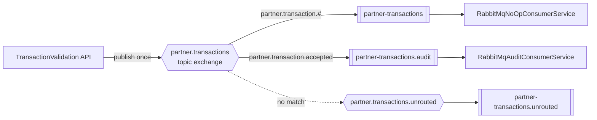
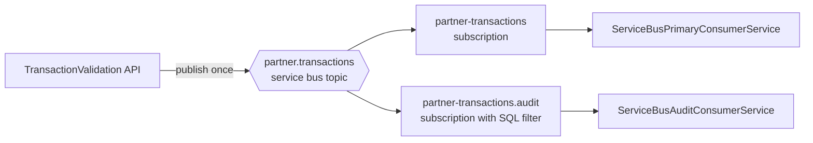

# Messaging Topology and Consumer Routing

Status: Active architecture reference

This document defines the current messaging architecture: one published transaction event is routed to independent downstream consumers without the API knowing which consumers exist.

Related documents:

- Primary architecture overview: [Architecture_design.md](Architecture_design.md)
- Runtime lifecycle: [../diagram/message_processing_lifecycle_sequence.md](../diagram/message_processing_lifecycle_sequence.md)
- Idempotency semantics: [api_idempotency_flow_and_semantics.md](api_idempotency_flow_and_semantics.md)

---

## 1. Design intent

The API publishes one business event to a broker-facing contract. The broker decides which consumers receive it.

This removes producer-to-consumer coupling. The API does not enumerate downstream services or hardcode destination queues. Each consumer declares its own interest through queue bindings or topic subscriptions.

The runtime broker is selected by `MESSAGING__BROKERTYPE`. Both RabbitMQ and Azure Service Bus implement the same architecture contract:

- one accepted event is published once
- each consumer gets its own copy or subscription view
- the audit path is filtered to accepted events only
- consumers deduplicate by `message-id`
- retries remain safe because duplicate delivery is idempotent

---

## 2. Shared design principles

### 2.1 Producer owns publication, not delivery topology

The API publishes a single transaction envelope and does not directly enumerate downstream consumers.

### 2.2 Consumers own their own delivery path

Each consumer owns its own queue or subscription and declares the routing/filter rule that matches its business interest.

### 2.3 Fan-out is explicit and independent

The same transaction event is delivered to both the primary and audit paths without coupling them together.

### 2.4 Acknowledgement and retry remain consumer-owned

The message is not considered complete until each consumer has processed and acknowledged its own copy.

### 2.5 Contract remains transport-agnostic

The core domain model and API behavior are independent of RabbitMQ or Azure Service Bus names, filters, or queues.

---

## 3. Current runtime topology

### 3.1 Broker abstraction layer

The application selects one broker implementation at runtime:

```csharp
if (MESSAGING__BROKERTYPE == "AzureServiceBus")
{
    services.AddAzureServiceBusMessagingServices(configuration);
}
else
{
    services.AddRabbitMqMessagingServices(configuration);
}
```

This preserves a consistent domain contract while allowing each broker to implement the same behavior using its native topology:

- RabbitMQ uses queues and exchange bindings
- Azure Service Bus uses a topic and subscriptions

Both broker implementations satisfy the same architecture contract for event fan-out and consumer isolation.

---

## 4. RabbitMQ active topology

### 4.1 Topology model



### 4.2 Routing model

The primary consumer is interested in all partner transaction messages via a wildcard binding pattern:

```text
partner.transaction.#
```

The audit consumer is intentionally narrower and listens only to accepted events:

```text
partner.transaction.accepted
```

This creates a true multi-consumer fan-out pattern without coupling the audit path to the primary path.

### 4.3 Ownership model

| Resource | Owner | Notes |
|---|---|---|
| Exchange | Publisher/API | Shared contract surface |
| Primary queue | Primary consumer | Owns its binding and consume loop |
| Audit queue | Audit consumer | Owns accepted-only binding |
| Alternate exchange | Broker bootstrap | Captures unroutable traffic |

The important architectural rule is that the queue is not shared. Independent consumers must each own their own queue.

---

## 5. Azure Service Bus active topology

### 5.1 Topology model



### 5.2 Routing and filtering model

Azure Service Bus uses topic subscriptions instead of RabbitMQ queues. The subscription model mirrors the same business intent:

- primary subscription receives all messages in the topic
- audit subscription receives only accepted events via a SQL filter such as:

```sql
eventType = 'partner.transaction.accepted'
```

This preserves the same delivery semantics as RabbitMQ, while using Azure-native subscription filtering instead of exchange binding patterns.

### 5.3 Ownership model

| Resource | Owner | Notes |
|---|---|---|
| Topic | Publisher/API | Shared publish contract |
| Primary subscription | Primary consumer | Subscription owns its message interest |
| Audit subscription | Audit consumer | Filtered to accepted events |
| Processor | Consumer service | Owns receive loop and ack behavior |

Like RabbitMQ, the design depends on independent subscription ownership rather than shared competing consumers.

---

## 6. Shared message contract

All brokers use the same domain envelope contract regardless of transport. The message payload and metadata are designed to be broker-neutral.

Essential envelope metadata:

- `message-id`: unique event identity for deduplication and tracing
- `correlation-id`: end-to-end tracing across processing steps
- `transaction-id`: domain-level transaction identity
- `event-type` or equivalent routing metadata: used for filtering and consumer selection

The envelope is created in the core domain layer and is not specific to RabbitMQ or Azure Service Bus. The broker adapters translate that contract into the native message format of the current broker.

---

## 7. Consumer routing behavior

### 7.1 Primary consumer

The primary path is intended for the core business processing flow.

Responsibilities:

- accept the transaction message
- record processing state
- validate downstream business semantics
- acknowledge the message only after successful handling

### 7.2 Audit consumer

The audit path is intentionally narrower and is only interested in accepted outcomes.

Responsibilities:

- record the accepted event
- maintain an audit trail or evidence store
- avoid processing unrelated event types
- acknowledge its own copy after successful recording

### 7.3 Deduplication and retry safety

At-least-once delivery is the active model. Consumers therefore apply message deduplication by `message-id` before side effects.

This mirrors the API idempotency model and prevents duplicate business writes when a delivery is retried after a temporary failure.

---

## 8. Failure handling and retry semantics

### 8.1 Publisher confirm and broker acceptance

The broker confirms that the event was accepted by the broker. This does not guarantee consumer-side processing completion.

### 8.2 Consumer failure before ack

If a consumer fails before acknowledging its message:

- the message remains unacknowledged
- the broker may redeliver it after reconnect or recovery
- the consumer must treat the duplicate as safe via idempotency checks

### 8.3 Consumer failure after ack

If the consumer acknowledges before completion, the message is not redelivered. This is only safe when all required side effects are truly complete before the acknowledge call.

### 8.4 Unroutable traffic

When a message does not match any meaningful routing rule, the broker should still surface this via a dead-letter or alternate path rather than silently dropping it.

This is part of the operational safety model.

---

## 9. Why this architecture is the current target

This design solves the core architectural problem of the earlier single-queue model:

- the API does not need to know all downstream consumers
- new consumers can be added without modifying producer code
- the primary and audit paths are independent and recover independently
- message flow remains portable across supported brokers

This is the architecture the solution is currently designed around, and it remains valid for both RabbitMQ and Azure Service Bus.

---

## 10. Design constraints

The active architecture intentionally keeps the following constraints:

1. No per-consumer publisher logic in the API layer.
2. No broker-specific concepts in the core business layer.
3. No shared competing consumer queue for independent processing paths.
4. No business side effects without deduplication guardrails.
5. Only one broker implementation is active at runtime, selected by configuration.

---

## 11. Summary

The current architecture is a broker-neutral, multi-consumer fan-out design. The API publishes a single message, and the broker routes it to the relevant consumers according to topology rules.

- RabbitMQ uses a topic exchange and queue bindings.
- Azure Service Bus uses a topic and subscription filters.
- Both brokers satisfy the same business contract and operational behavior.
- The design is intentionally independent, recoverable, and extendable.

This is the active architecture and replaces the retired default-exchange baseline described in the older design notes.
| Queue ownership | Publisher | Consumer |
| Adding a consumer | API change + deploy | Broker binding only |
| Failure isolation | Shared | Per-consumer DLQ |
| Unroutable messages | Silently dropped | Captured via alternate exchange |

The default-exchange approach is retained only as a rollback reference and is retired from the active publish path. The exchange-based topology is implemented and verified with two independent consumer queues.
