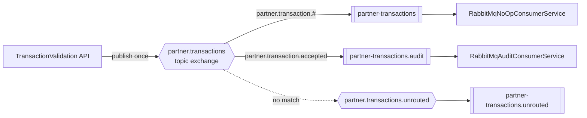
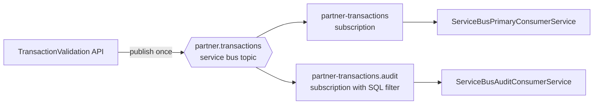

# Messaging Topology and Consumer Routing

Status: Active architecture reference

This document defines the current messaging architecture: one published transaction event is routed to independent downstream consumers without the API knowing which consumers exist.

Related documents:

- Primary architecture overview: [Architecture_design.md](Architecture_design.md)
- Message lifecycle details: see Section 11 below
- Idempotency semantics: [api_idempotency_flow_and_semantics.md](api_idempotency_flow_and_semantics.md)
- Messaging behavior and implementation patterns: [../features/messaging/README.md](../features/messaging/README.md)

---

## 1. Design intent

The API publishes one business event to a broker-facing contract. The broker decides which consumers receive it.

This removes producer-to-consumer coupling. The API does not enumerate downstream services or hardcode destination queues. Each consumer declares its own interest through queue bindings or topic subscriptions.

The runtime broker is selected by `MESSAGING__BROKERTYPE`. Both RabbitMQ and Azure Service Bus implement the same architecture contract:

- one accepted event is published once
- each consumer gets its own copy or subscription view
- the audit path is filtered to accepted events only
- each consumer acknowledges or completes its own delivery
- redelivery is possible when processing fails before acknowledgement

---

## 2. Shared design principles

### 2.1 Producer owns publication, not delivery topology

The API publishes a single transaction envelope and does not directly enumerate downstream consumers.

### 2.2 Consumers own their own delivery path

Each consumer owns its own queue or subscription and declares the routing/filter rule that matches its business interest.

### 2.3 Fan-out is explicit and independent

The same transaction event is delivered to both the primary and audit paths without coupling them together.

### 2.4 Acknowledgement and retry remain consumer-owned

The message is not considered complete until each consumer has processed and acknowledged its own copy.

### 2.5 Contract remains transport-agnostic

The core domain model and API behavior are independent of RabbitMQ or Azure Service Bus names, filters, or queues.

---

## 3. Current runtime topology

### 3.1 Broker abstraction layer

The application selects one broker implementation at runtime through the shared registration boundary:

```csharp
services.AddConfiguredBroker(
    configuration,
    RegisterRabbitMq,
    RegisterAzureServiceBus);
```

This preserves a consistent domain contract while allowing each broker to implement the same behavior using its native topology:

- RabbitMQ uses queues and exchange bindings
- Azure Service Bus uses a topic and subscriptions

Both broker implementations satisfy the same architecture contract for event fan-out and consumer isolation.

---

## 4. RabbitMQ active topology

### 4.1 Topology model


```mermaid
flowchart LR
    API[TransactionValidation API] -->|publish once| EX{{partner.transactions<br/>topic exchange}}
    EX -->|partner.transaction.#| Q1[[partner-transactions]]
    EX -->|partner.transaction.accepted| Q2[[partner-transactions.audit]]
    Q1 --> P[RabbitMqNoOpConsumerService]
    Q2 --> A[RabbitMqAuditConsumerService]
    EX -.no match.-> AE{{partner.transactions.unrouted}}
    AE --> U[[partner-transactions.unrouted]]
```

### 4.2 Routing model

The primary consumer is interested in all partner transaction messages via a wildcard binding pattern:

```text
partner.transaction.#
```

The audit consumer is intentionally narrower and listens only to accepted events:

```text
partner.transaction.accepted
```

This creates a true multi-consumer fan-out pattern without coupling the audit path to the primary path.

### 4.3 Ownership model

| Resource | Owner | Notes |
|---|---|---|
| Main and alternate exchanges | API topology initializer and primary Mock consumer | Idempotent declarations support local self-initialization |
| Primary queue | Primary consumer | Owns its binding and consume loop |
| Audit queue | Audit consumer | Owns accepted-only binding |
| Unrouted queue | API topology initializer and primary Mock consumer | Receives alternate-exchange traffic |

The important architectural rule is that the queue is not shared. Independent consumers must each own their own queue.

---

## 5. Azure Service Bus active topology

### 5.1 Topology model


```mermaid
flowchart LR
    API[TransactionValidation API] -->|publish once| TOPIC{{partner.transactions<br/>service bus topic}}
    TOPIC --> S1[partner-transactions<br/>subscription]
    TOPIC --> S2[partner-transactions.audit<br/>subscription with SQL filter]
    S1 --> P[ServiceBusPrimaryConsumerService]
    S2 --> A[ServiceBusAuditConsumerService]
```

### 5.2 Routing and filtering model

Azure Service Bus uses topic subscriptions instead of RabbitMQ queues. Bicep provisions the topic, subscriptions, and SQL rules:

- primary subscription receives accepted, rejected, and pending event types
- audit subscription receives only accepted events via a SQL filter such as:

```sql
eventType = 'partner.transaction.accepted'
```

This preserves the same delivery semantics as RabbitMQ, while using Azure-native subscription filtering instead of exchange binding patterns.

### 5.3 Ownership model

| Resource | Owner | Notes |
|---|---|---|
| Namespace and topic | Bicep infrastructure | Shared publish contract and private networking |
| Primary subscription/rule | Bicep infrastructure | Accepted, rejected, and pending event types |
| Audit subscription/rule | Bicep infrastructure | Accepted events only |
| Processor | Consumer service | Owns receive loop and ack behavior |

Like RabbitMQ, the design depends on independent subscription ownership rather than shared competing consumers.

---

## 6. Shared message contract

All brokers use the same domain envelope contract regardless of transport. The message payload and metadata are designed to be broker-neutral.

Essential envelope metadata:

- `message-id`: unique event identity for delivery observation and downstream deduplication if implemented
- `correlation-id`: end-to-end tracing across processing steps
- `event-type` or equivalent routing metadata: used for filtering and consumer selection

The envelope is created in the core domain layer and is not specific to RabbitMQ or Azure Service Bus. The broker adapters translate that contract into the native message format of the current broker.

---

## 7. Consumer routing behavior

### 7.1 Primary consumer

The primary path is intended for the core business processing flow.

Responsibilities:

- deserialize the transaction envelope
- record an in-memory observation for runtime tests
- acknowledge or complete the message after recording

### 7.2 Audit consumer

The audit path is intentionally narrower and is only interested in accepted outcomes.

Responsibilities:

- deserialize the accepted transaction envelope
- record an independent in-memory observation for runtime tests
- acknowledge or complete its own copy after recording
- support a one-shot failure-before-acknowledgement test path

### 7.3 Redelivery and idempotency boundary

At-least-once redelivery is possible. The current consumers record every observed delivery and do not deduplicate by `message-id`.

Any future durable, non-idempotent side effect must add consumer-owned deduplication or another idempotent processing boundary. API idempotency does not prevent broker redelivery.

---

## 8. Failure handling and retry semantics

### 8.1 Publisher confirm and broker acceptance

The broker confirms that the event was accepted by the broker. This does not guarantee consumer-side processing completion.

### 8.2 Consumer failure before ack

If a consumer fails before acknowledging its message:

- the message remains unacknowledged
- the broker may redeliver it after reconnect or recovery
- the current observation store records both deliveries

### 8.3 Consumer failure after ack

If the consumer acknowledges before completion, the message is not redelivered. This is only safe when all required side effects are truly complete before the acknowledge call.

### 8.4 Unroutable traffic

RabbitMQ forwards unmatched routing keys to the configured alternate exchange and unrouted queue. This is not a poison-message dead-letter queue, and no basic-return warning handler is implemented.

Azure Service Bus moves repeatedly unsuccessful deliveries to its broker-managed dead-letter subqueue after the configured maximum delivery count. The application does not implement a dead-letter processor.

---

## 9. Architecture Outcome

This design provides:

- the API does not need to know all downstream consumers
- new consumers can be added without modifying producer code
- the primary and audit paths are independent and recover independently
- message flow remains portable across supported brokers

## 10. Design constraints

The active architecture intentionally keeps the following constraints:

1. No per-consumer publisher logic in the API layer.
2. No broker-specific concepts in the core business layer.
3. No shared competing consumer queue for independent processing paths.
4. Current consumers are observation/test services; durable non-idempotent handlers require additional deduplication.
5. Only one broker implementation is active at runtime, selected by configuration.
6. Service Bus filters are infrastructure-owned; consumer `Filter` option values are not applied by runtime code.
7. Publisher completion means broker/client acceptance, not consumer completion.

---

## 11. Message processing lifecycle

The message lifecycle spans the publish path, broker delivery, consumer processing, acknowledgement, and any retry or redelivery that occurs before the consumer finishes.

### 11.1 Lifecycle overview

1. The API receives a transaction request and validates it.
2. The API publishes a broker message using the configured broker implementation.
3. The broker routes the message to the relevant queue or subscription.
4. One or more consumers receive the message independently.
5. Each consumer processes its own message copy.
6. The consumer acknowledges completion if the work succeeds.
7. If processing fails before acknowledgement, the broker may redeliver the message.
8. The API and consumers remain decoupled from each other through the broker contract.

### 11.2 Publish path

The producer publishes the transactional envelope using the transport-neutral contract.

Key invariants:

- the producer publishes once per accepted business event
- message metadata binds the business event to routing information and consumer selection
- publish success proves broker acceptance, not downstream consumer completion
- the producer does not know or care which downstream consumers are attached to the topology

### 11.3 Delivery and consumer processing

Once published, the broker distributes the message according to the topology rules. Each consumer owns its own delivery loop:

1. receive message from broker
2. deserialize or map to the internal contract
3. validate message semantics and routing metadata
4. execute its local business or observation action
5. acknowledge the delivery if processing succeeds

If a consumer fails before acknowledgement, the broker may redeliver the message later. This is intentionally separate from the producer contract.

### 11.4 Acknowledgement and retry

Acknowledgement is the final consumer decision. A message is considered complete only when the consumer confirms successful processing.

The retry behavior is therefore:

- receive -> process -> acknowledge
- failure before acknowledgement -> redelivery or retry according to broker semantics
- downstream side effects must be designed to tolerate at-least-once semantics when applicable

### 11.5 Failure boundaries

The runtime lifecycle intentionally separates:

- producer acceptance from consumer completion
- transport delivery from business success
- routing configuration from consumer behavior
- broker retry from durable business idempotency

This means the system can tolerate transient delivery and consumer-level failures without collapsing the publish path into a single synchronous success model.

---

## 12. Summary

The current architecture is a broker-neutral, multi-consumer fan-out design. The API publishes a single message, and the broker routes it to the relevant consumers according to topology rules.

- RabbitMQ uses a topic exchange and queue bindings.
- Azure Service Bus uses a topic and subscription filters.
- Both brokers satisfy the same business contract and operational behavior.
- The design is intentionally independent, recoverable, and extendable.
- Message lifecycle behavior is a runtime narrative of the same architecture, not a separate competing authority.

The active architecture uses one publication and independent broker destinations. RabbitMQ uses a topic exchange and queues; Azure Service Bus uses a topic and subscriptions. The Mock runtime verifies routing and redelivery but is not a durable business-processing or audit store.
