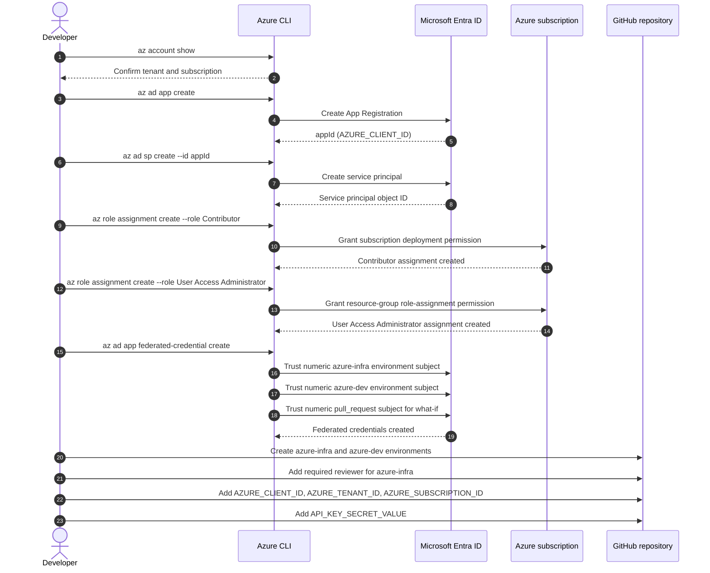
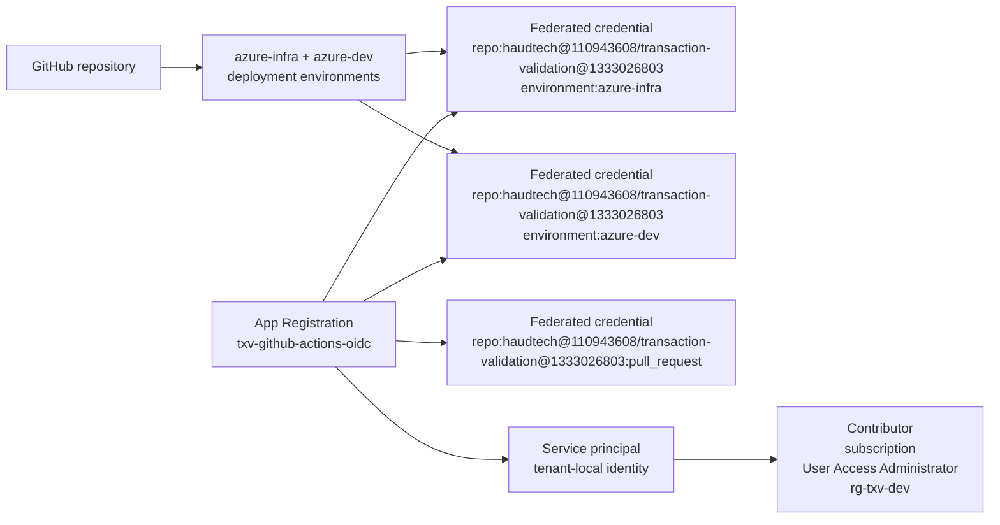
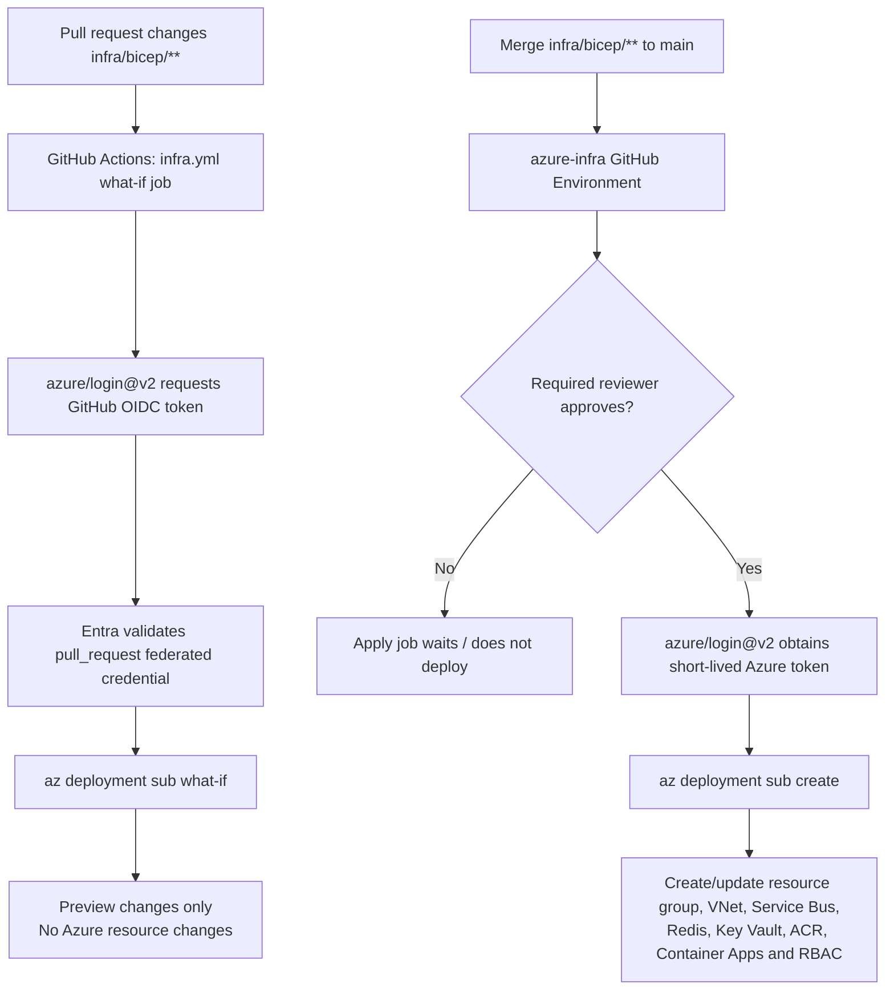
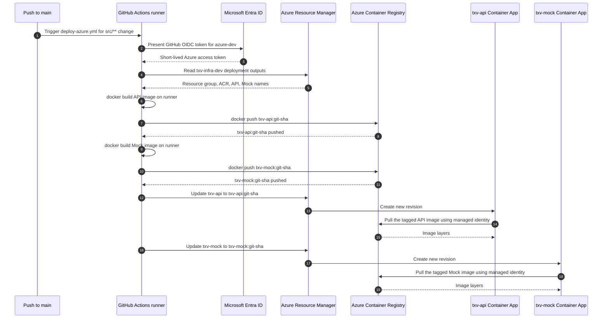
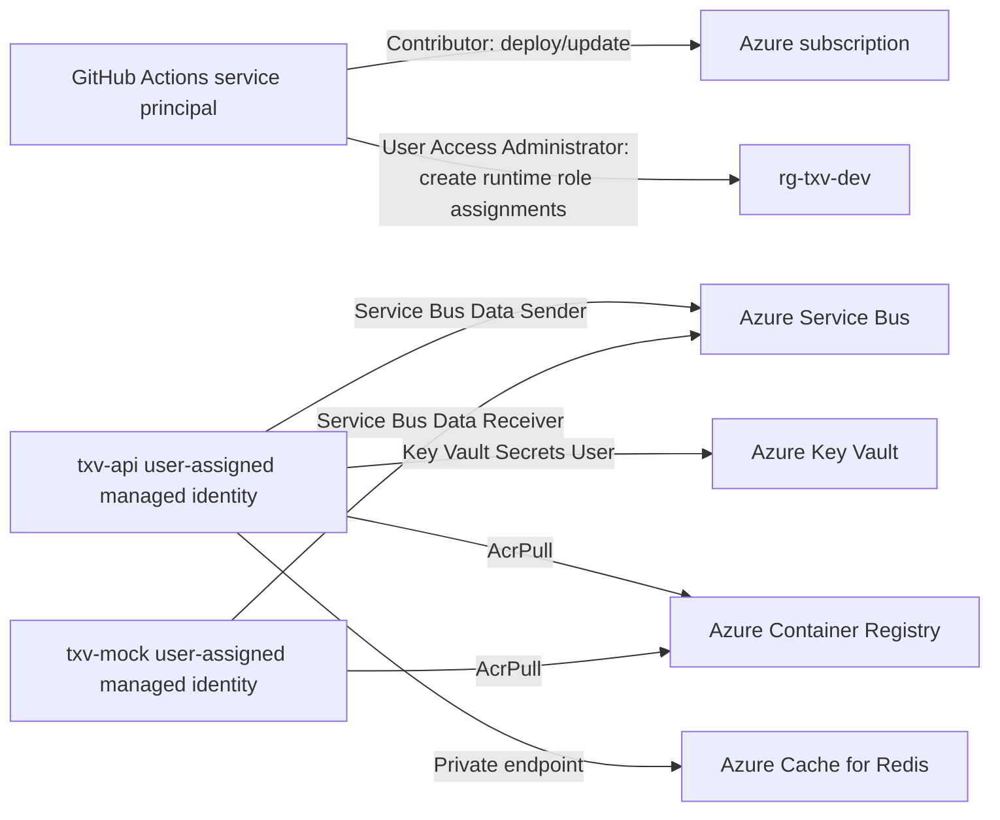
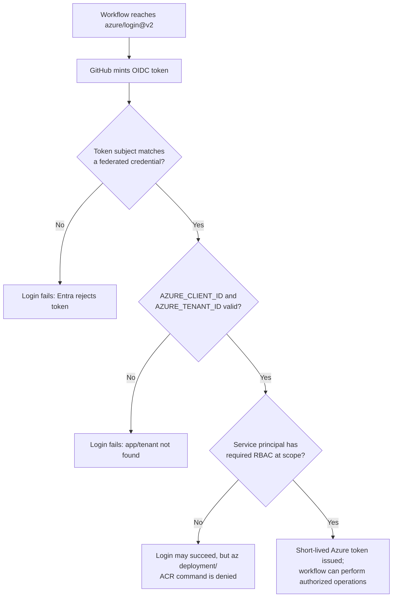

# GitHub Actions to Azure OIDC Workflow Diagrams

This companion to [oidc_prerequisite_setup.md](oidc_prerequisite_setup.md) models how GitHub Actions authenticates to Azure through OpenID Connect (OIDC), then deploys infrastructure and application images without a stored Azure client secret.

## 1. Actors and responsibilities

| Actor | Responsibility |
|---|---|
| Developer | Creates and reviews changes; approves protected infrastructure deployments |
| Azure CLI | Creates Entra application objects, federated credentials, and Azure RBAC role assignments during one-time setup |
| GitHub repository | Stores workflow files and repository secrets; emits workflow events |
| GitHub Environment | Applies deployment protection rules and identifies the intended deployment context (`azure-infra` or `azure-dev`) |
| GitHub Actions runner | Executes the selected workflow and requests a short-lived OIDC token |
| GitHub OIDC provider | Signs a token identifying the workflow repository and GitHub Environment |
| Microsoft Entra ID | Validates GitHub's token against the App Registration's federated credential and issues an Azure access token |
| App Registration | Defines the non-human application identity and trusted GitHub OIDC subjects |
| Service principal | Tenant-local representation of the App Registration; receives Azure RBAC permissions |
| Azure Resource Manager | Authorizes deployment operations using the access token and service principal's RBAC role |
| Azure Container Registry | Builds/stores images and authorizes Container Apps to pull them |
| Azure Container Apps | Runs API/Mock containers using managed identities to access Azure resources |

## 2. One-time setup: identity and trust

This setup was performed with the commands in [oidc_prerequisite_setup.md](oidc_prerequisite_setup.md).

### Output of setup

## 3. Infrastructure workflow: preview then apply

[infra.yml](../../.github/workflows/infra.yml) manages Bicep changes. It is intentionally separate from the application-image deployment workflow because network, identity, and data-plane infrastructure changes have a larger blast radius.

## 4. Application workflow: build, push, and update revisions

[deploy-azure.yml](../../.github/workflows/deploy-azure.yml) is triggered by application-source changes on `main`. It does not reapply Bicep infrastructure.

## 5. Runtime authorization boundaries

The GitHub workflow identity is not the same identity as the running Container Apps. The workflow deploys resources; each Container App's managed identity accesses runtime dependencies.

## 6. Authentication decision tree

## 7. Use cases and expected controls

| Use case | Trigger | Identity used | Required control | Result |
|---|---|---|---|---|
| Preview Bicep | Pull request modifies `infra/bicep/**` | GitHub service principal without a GitHub Environment | Matching `pull_request` federated credential + Contributor | `what-if` reports proposed changes only |
| Apply Bicep | Push to `main` after an infra change | GitHub service principal through `azure-infra` | OIDC + Contributor + User Access Administrator + required reviewer approval | Azure resources are created/updated |
| Deploy application image | Push to `main` modifies `src/**` or manual dispatch | GitHub service principal through `azure-dev` | OIDC + permission to build/push/update | Runner-built images are pushed to ACR; apps receive new revisions |
| API sends a message | Accepted transaction request | `txv-api` user-assigned managed identity | Service Bus Data Sender | Azure Service Bus accepts topic message |
| Mock consumes a message | Service Bus delivery | `txv-mock` user-assigned managed identity | Service Bus Data Receiver | Consumer reads/completes subscription message |
| API reads its API key / Redis config | Container App startup | `txv-api` user-assigned managed identity | Key Vault Secrets User | Key Vault-backed secret becomes Container App config |
| App pulls its image | Revision startup/scale out | API or Mock managed identity | AcrPull | ACR serves the required tagged image |

## 8. What must match exactly

OIDC federation is strict. These values must agree or the workflow login fails:

| GitHub workflow / environment | Entra federated credential |
|---|---|
| `environment: azure-infra` in `infra.yml` apply job | numeric subject ending `environment:azure-infra` |
| No Environment in `infra.yml` what-if job | numeric subject ending `pull_request` |
| `environment: azure-dev` in `deploy-azure.yml` | numeric subject ending `environment:azure-dev` |
| Repository `haudtech/transaction-validation` | subject beginning `repo:haudtech/transaction-validation:` |
| `permissions: id-token: write` | GitHub must be allowed to mint an OIDC token |
| `AZURE_CLIENT_ID`, `AZURE_TENANT_ID`, `AZURE_SUBSCRIPTION_ID` secrets | Existing Entra application and target Azure subscription |

## 9. Operational checklist

- [x] App Registration and service principal exist.
- [x] `azure-infra`, `azure-dev`, and pull-request preview federated credentials exist with matching numeric GitHub subjects.
- [x] Service principal has `Contributor` at subscription scope and `User Access Administrator` at `rg-txv-dev` scope.
- [x] GitHub Environments exist; `azure-infra` requires reviewer approval.
- [x] Required GitHub repository secrets exist.
- [x] Run `infra.yml` successfully through its approved apply job.
- [x] Run `deploy-azure.yml` successfully and confirm both revisions pull their tagged ACR images.
- [x] Complete deployed-environment validation in [azure_deployment_plan.md](../implementation/azure_deployment_plan.md).
- [ ] Run the repository E2E suite and audit-consumer redelivery check from a runner that can reach the Mock app's internal-only ingress.
