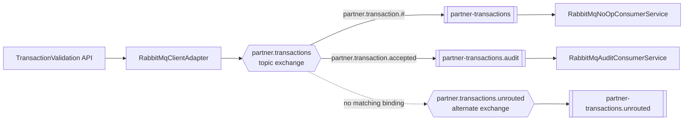
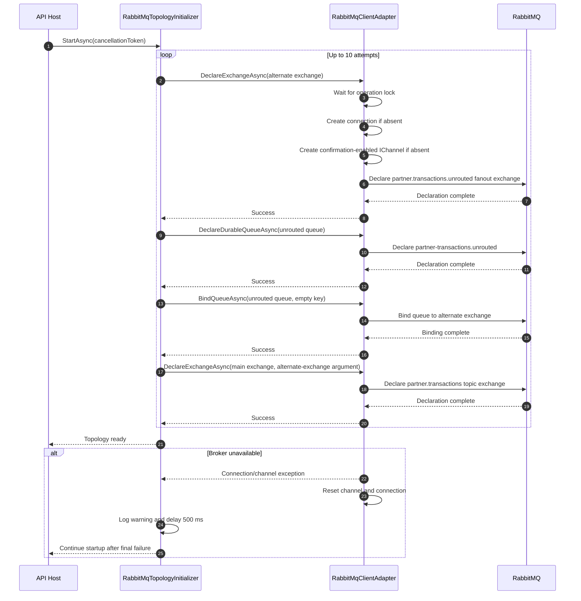
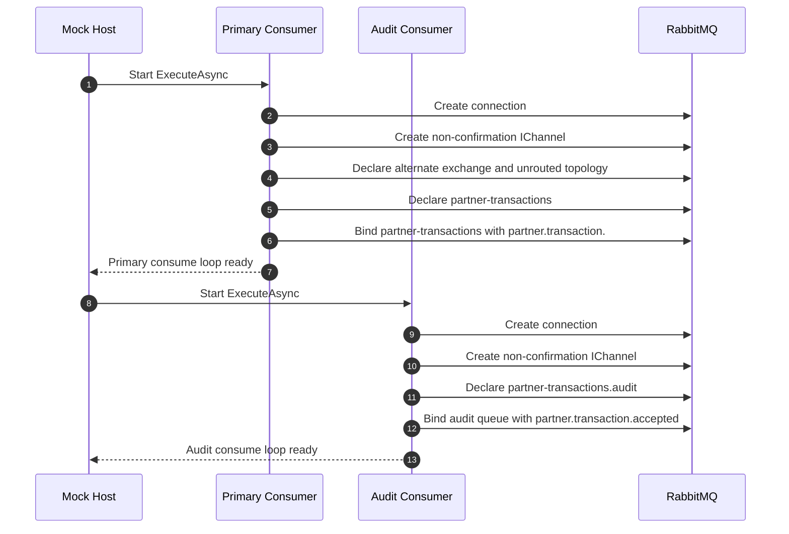
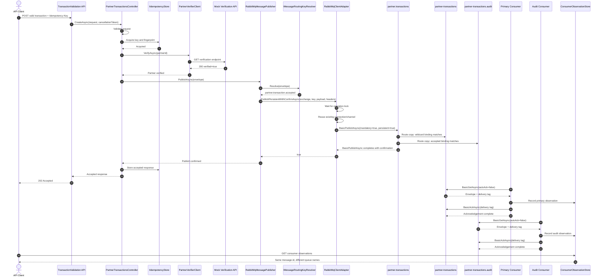
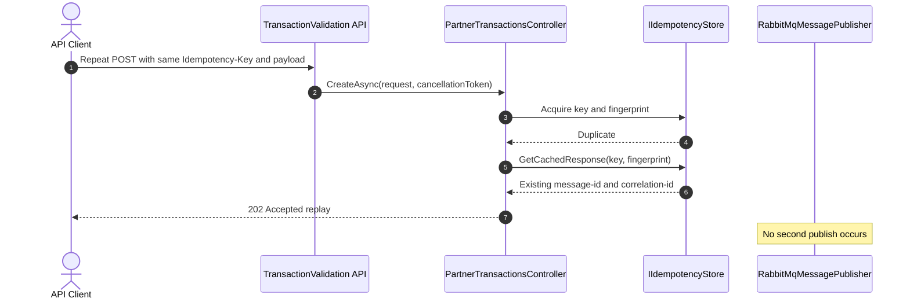
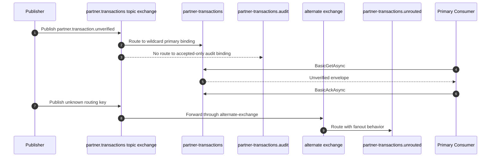
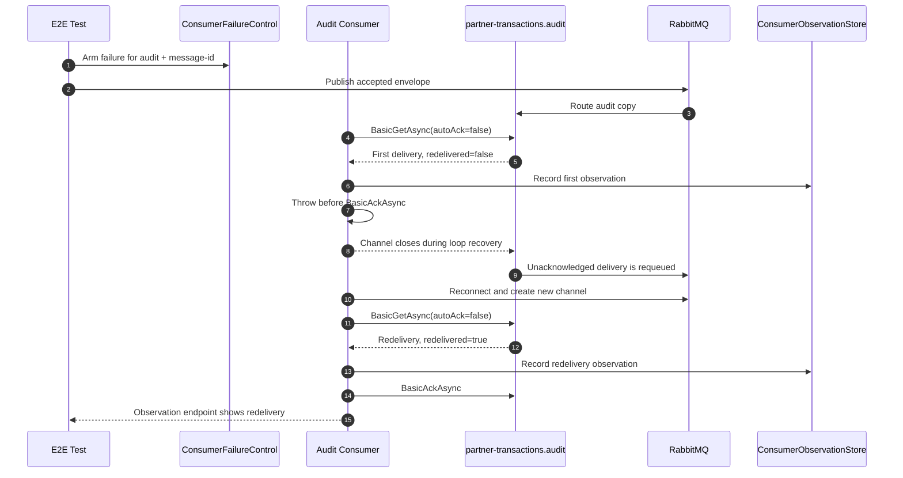

# Message Processing Lifecycle

This document describes the complete RabbitMQ message lifecycle in the TransactionValidation solution, from an accepted HTTP request through publisher confirmation, topic-exchange routing, independent consumer queues, acknowledgement, recovery, and resource shutdown.

The supported client is RabbitMQ.Client `7.0.0`. Publisher confirmations are enabled when the API channel is created. In this version, successful completion of `BasicPublishAsync` represents broker confirmation.

## 1. Participants

| Participant | Responsibility |
|---|---|
| API client | Sends the transaction request |
| TransactionValidation API | Authenticates, validates, verifies, and coordinates the request |
| RabbitMqMessagePublisher | Serializes the envelope, resolves the routing key, and delegates publishing |
| RabbitMqClientAdapter | Owns the API-side RabbitMQ connection/channel and broker operations |
| RabbitMqTopologyInitializer | Creates shared exchange and unrouted-message topology at API startup |
| RabbitMQ topic exchange | Routes one publication to every matching queue binding |
| Primary queue | `partner-transactions` |
| Audit queue | `partner-transactions.audit` |
| Primary consumer | `RabbitMqNoOpConsumerService` |
| Audit consumer | `RabbitMqAuditConsumerService` |
| ConsumerObservationStore | Records local POC observations for E2E verification |

## 2. Topology



Each independent consumer has its own queue. A shared queue would create competing-consumer behavior and would not deliver the same publication to both consumers.

## 3. API Startup and Topology Initialization

The API registers `RabbitMqClientAdapter` as a singleton and registers `RabbitMqTopologyInitializer` as a hosted service. The initializer declares the shared topology outside the request path.



The initializer is retryable and non-fatal. A later publish can recreate the adapter resources and retry broker operations.

## 4. Consumer Startup and Queue Ownership

Both consumers run in the single Mock process, but each creates and owns its own RabbitMQ connection, channel, queue, and binding configuration.



The primary consumer also declares the shared exchange and alternate topology for local self-initialization. The audit consumer declares only its own queue and binding.

## 5. Accepted Message: Publish Through Acknowledgement



`BasicPublishAsync` confirmation means the broker accepted the publish. It does not mean the consumers have completed processing. Each consumer acknowledges its own queue copy independently.

## 6. Duplicate Request Lifecycle



The duplicate request does not create another broker message. The original publication remains independently acknowledged by each consumer queue.

## 7. Unverified and Unroutable Messages



The current alternate-exchange topology captures unknown routing keys. Basic-return warning logging remains an optional enhancement because publisher confirmation and alternate-exchange capture already provide the current POC behavior.

## 8. Failure Before Acknowledgement and Redelivery

The Phase 7 POC arms a targeted failure for one audit message through the Mock test-support endpoint.



The primary queue copy is independent. The audit failure does not remove or invalidate the primary queue’s message.

## 9. Resource Lifecycle and Close Behavior

### API publisher adapter

The API adapter is a singleton:

```text
First topology or publish operation
    -> acquire operation lock
    -> create connection if absent
    -> create channel if absent
    -> perform broker operation
    -> release operation lock

Subsequent operations
    -> reuse the same connection and channel

Broker/channel exception
    -> reset channel reference
    -> reset connection reference
    -> dispose channel
    -> dispose connection
    -> propagate exception
    -> next operation creates fresh resources

Application shutdown
    -> DI invokes IAsyncDisposable
    -> acquire operation lock
    -> mark adapter disposed
    -> dispose channel
    -> dispose connection
    -> dispose semaphore
```

The API does not close the connection after every message. Reusing the connection/channel is part of the adapter lifecycle design.

### Mock consumers

Each consumer owns resources for its consume loop:

```text
ConsumeLoopAsync starts
    -> create ConnectionFactory
    -> create connection
    -> create channel
    -> declare its queue and binding
    -> poll until cancellation or exception

Cancellation
    -> leave polling loop
    -> await using disposes channel
    -> await using disposes connection
    -> hosted service stops

Broker/channel exception
    -> loop exits through exception
    -> channel and connection are disposed
    -> ExecuteAsync logs warning
    -> wait 2 seconds
    -> create a new connection/channel
    -> retry consume loop
```

### Why closing matters

- Closing a channel after an unacknowledged delivery causes RabbitMQ to requeue the delivery.
- Closing a connection releases all channels owned by that connection.
- The API adapter reset prevents reuse of a failed channel.
- Consumer retry creates fresh resources instead of polling a broken channel.
- Acknowledgement happens before normal resource close; shutdown cancellation does not intentionally acknowledge new messages.

## 10. Error Paths

| Failure point | Result |
|---|---|
| Request validation | API returns `400`; no publish occurs |
| Partner verification timeout | API returns upstream timeout response; idempotency key is released |
| Connection/channel creation | Adapter resets partial resources and propagates the exception |
| `BasicPublishAsync` nack or mandatory routing failure | Publish exception propagates; API does not return accepted success |
| Missing cached response for duplicate key | API returns conflict; no publish occurs |
| Consumer deserialization failure | Consumer fails before acknowledgement; message can be redelivered after channel recovery |
| Consumer failure before ack | Delivery remains unacknowledged and is requeued on channel close |
| Consumer failure after ack | Message is already acknowledged; it is not redelivered |
| Host shutdown | Cancellation exits loops and disposes owned resources |

## 11. Developer Checklist

When adding another consumer:

- [ ] Create a dedicated durable queue.
- [ ] Bind the queue to `partner.transactions`.
- [ ] Choose a binding pattern based on message interest.
- [ ] Never reuse another consumer’s queue for independent fan-out.
- [ ] Consume with manual acknowledgement when processing must complete before removal.
- [ ] Acknowledge only after successful processing.
- [ ] Handle redelivery safely using `message-id` deduplication.
- [ ] Log `message-id`, `correlation-id`, routing key, queue, and delivery status.
- [ ] Define dead-letter behavior for permanent failures.
- [ ] Add broker-backed tests for routing and acknowledgement behavior.

## 12. Current POC Evidence

The local POC has verified:

- Two consumers use independent queues.
- One accepted publication reaches both queues.
- The audit accepted-only binding excludes unverified messages.
- A targeted audit failure before acknowledgement causes redelivery.
- The full E2E suite passes with `8` tests.
- Unit tests pass with `37` tests.
- Integration tests pass with `11` tests.

The POC does not include Azure Function hosting, deployment, or cloud networking.
