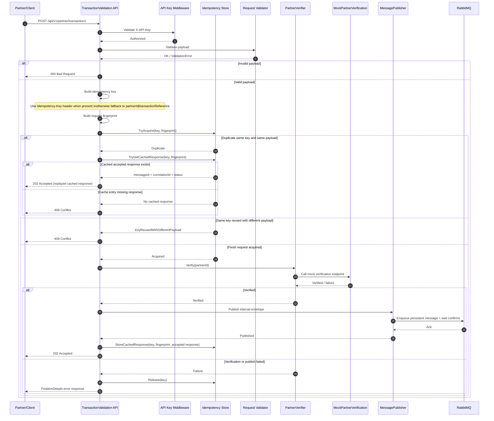

# API Transaction Sequence Diagram

This diagram shows the end-to-end request flow for `POST /api/v1/partner/transactions` in the current solution.

It focuses on the runtime path through API key authorization, request validation, replay-first idempotency handling, partner verification, message publishing, and error fallback behavior.

Use this diagram to understand the three idempotency outcomes:

- duplicate request with the same payload returns the cached `202 Accepted` response
- duplicate key with a different payload returns `409 Conflict`
- fresh request continues through verification, publish, and cached response storage

It also captures the failure cleanup behavior: if verification or publishing fails after acquisition, the idempotency key is released so a later retry can proceed.

