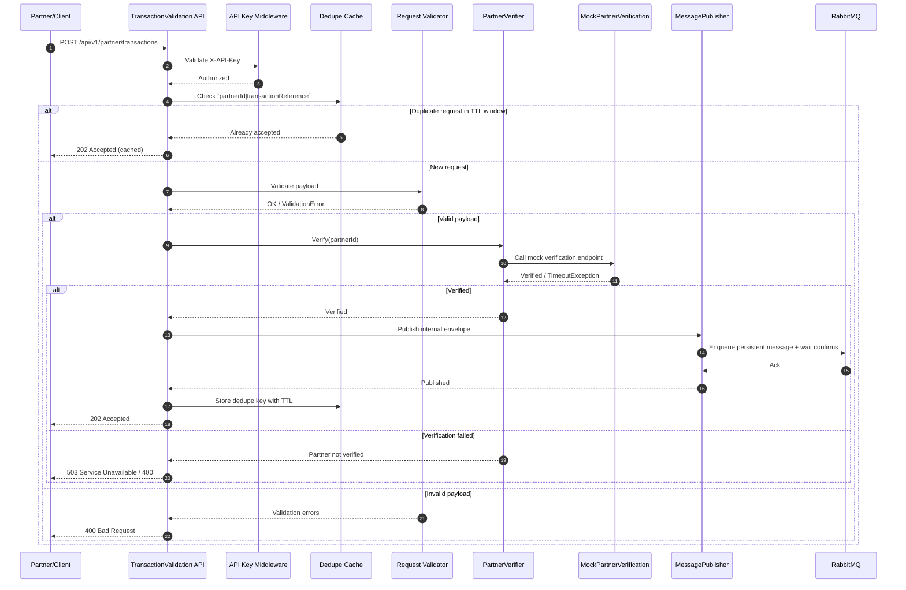

# Sequence Diagram — Partner Integration BFF

This sequence diagram captures the workflow from partner request through verification, publish, and acknowledgement.

```mermaid
sequenceDiagram
   autonumber
   participant P as Partner/Client
   participant API as TransactionValidation API
   participant Auth as API Key Middleware
   participant Cache as Dedupe Cache
   participant Validator as Request Validator
   participant Verifier as PartnerVerifier
   participant Mock as MockPartnerVerification
   participant Publisher as MessagePublisher
   participant MQ as RabbitMQ

   P->>API: POST /api/v1/partner/transactions
   API->>Auth: Validate X-API-Key
   Auth-->>API: Authorized
   API->>Cache: Check `partnerId|transactionReference`
   alt Duplicate request in TTL window
      Cache-->>API: Already accepted
      API-->>P: 202 Accepted (cached)
   else New request
      API->>Validator: Validate payload
      Validator-->>API: OK / ValidationError
      alt Valid payload
         API->>Verifier: Verify(partnerId)
         Verifier->>Mock: Call mock verification endpoint
         Mock-->>Verifier: Verified / TimeoutException
         alt Verified
            Verifier-->>API: Verified
            API->>Publisher: Publish internal envelope
            Publisher->>MQ: Enqueue persistent message + wait confirms
            MQ-->>Publisher: Ack
            Publisher-->>API: Published
            API->>Cache: Store dedupe key with TTL
            API-->>P: 202 Accepted
         else Verification failed
            Verifier-->>API: Partner not verified
            API-->>P: 503 Service Unavailable / 400
         end
      else Invalid payload
         Validator-->>API: Validation errors
         API-->>P: 400 Bad Request
      end
   end
```
