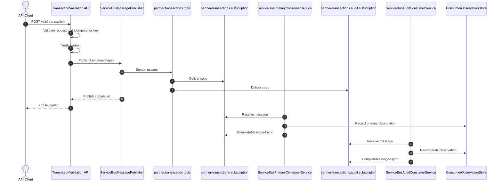

# Azure Service Bus Multiple Consumer Migration Plan

## 1. Purpose

This plan mirrors the existing RabbitMQ proof of concept described in [multiple_consumer_poc_plan.md](multiple_consumer_poc_plan.md) but targets Azure Service Bus as the Azure-native replacement for the local RabbitMQ deployment.

The goal is to preserve the same business outcome:

- one transaction message is published once,
- the broker fans it out to multiple independent consumers,
- each consumer receives its own copy,
- both consumers record the same message identity and correlation identity,
- the application remains ready for Azure-native deployment without depending on a self-managed RabbitMQ broker.

This plan is intentionally aligned to the current implementation in:

- [src/TransactionValidation.Mock/Program.cs](../../src/TransactionValidation.Mock/Program.cs)
- [src/TransactionValidation.Mock/Services/RabbitMqNoOpConsumerService.cs](../../src/TransactionValidation.Mock/Services/RabbitMqNoOpConsumerService.cs)
- [src/TransactionValidation.Mock/Services/RabbitMqAuditConsumerService.cs](../../src/TransactionValidation.Mock/Services/RabbitMqAuditConsumerService.cs)
- [src/TransactionValidation.Mock/Options/RabbitMqConsumerOptions.cs](../../src/TransactionValidation.Mock/Options/RabbitMqConsumerOptions.cs)
- [src/TransactionValidation.Mock/appsettings.json](../../src/TransactionValidation.Mock/appsettings.json)

## 2. Target Behavior

```text
One publication
    -> partner.transactions topic
        -> partner-transactions subscription
            -> ServiceBusPrimaryConsumerService
        -> partner-transactions.audit subscription
            -> ServiceBusAuditConsumerService
```

Both consumers must observe the same `message-id` and `correlation-id`, while reading from different Azure Service Bus subscriptions.

This is the Azure Service Bus equivalent of the RabbitMQ fan-out pattern where a single topic exchange sends copies to independent queues.

## 3. Locked Decisions

- [x] Keep the same business contract: one published envelope, two independent consumer views.
- [x] Keep the primary consumer as the business observation consumer.
- [x] Keep the audit consumer as the second independent observer.
- [x] Use one Azure Service Bus topic for the published event.
- [x] Use one subscription per consumer.
- [x] Use independent subscription filters where needed for selective routing.
- [x] Preserve message identity and correlation identity across both consumer paths.
- [x] Keep the publisher unaware of consumer names and subscription names.
- [x] Keep each consumer isolated to a dedicated subscription and not a shared queue.
- [x] Keep the implementation small and aligned with the current Mock test harness.
- [x] Prepare for Azure deployment without introducing a RabbitMQ-specific assumption.

## 4. RabbitMQ-to-Service-Bus Mapping

| RabbitMQ concept | Azure Service Bus equivalent | Current intent |
|---|---|---|
| Topic exchange `partner.transactions` | Topic `partner.transactions` | Single publish point |
| Queue `partner-transactions` | Subscription `partner-transactions` | Primary business consumer |
| Queue `partner-transactions.audit` | Subscription `partner-transactions.audit` | Audit consumer |
| Routing key `partner.transaction.#` | Subscription filter or catch-all expression | Publish to both consumers |
| Routing key `partner.transaction.accepted` | Subscription filter on `messageType` / routing property | Selective routing |
| Durable queue | Durable subscription / queue-backed subscription | Stable delivery |
| `BasicGetAsync` polling | `ServiceBusProcessor` | Async message consumption |
| `BasicAckAsync` | `CompleteMessageAsync` | Message acknowledgment |
| `BasicNack` / redelivery | `AbandonMessageAsync` | Retry and redelivery |

## 5. Proposed Azure Topology

### 5.1 Shared topic

```text
Topic: partner.transactions
```

This topic replaces the RabbitMQ exchange and becomes the single publication point for all partner transaction events.

### 5.2 Consumer subscriptions

```text
Subscription: partner-transactions
Subscription: partner-transactions.audit
```

Each subscription is owned by one consumer and receives a copy of the same message when the filter matches.

### 5.3 Routing pattern

For the initial fan-out proof, both subscriptions should match the same published message, using one of the following approaches:

- a common subscription filter using a shared event property such as `eventType` or `routingKey`
- a general catch-all filter if the message is published to a single topic and all matching subscriptions are intentionally active

For selective routing, the audit subscription can use a stricter filter such as:

```text
eventType = 'partner.transaction.accepted'
```

This matches the existing RabbitMQ behavior in the plan where the audit queue is bound to `partner.transaction.accepted` while the primary queue receives broader events.

## 6. Proposed Implementation Structure

### 6.1 Option classes

Mirror the existing RabbitMQ pattern by creating separate Azure Service Bus option classes, each owning its own consumer configuration.

```csharp
namespace TransactionValidation.Mock.Options;

public abstract class ServiceBusConsumerOptions
{
    public required bool Enabled { get; set; }
    public required string FullyQualifiedNamespace { get; set; }
    public required string TopicName { get; set; }
    public required string SubscriptionName { get; set; }
    public required string ConnectionString { get; set; }
    public required bool AutoComplete { get; set; }
    public required int MaxConcurrentCalls { get; set; }
    public required string? SubscriptionFilter { get; set; }
}
```

```csharp
namespace TransactionValidation.Mock.Options;

public sealed class ServiceBusPrimaryConsumerOptions : ServiceBusConsumerOptions
{
    public const string SectionName = "ServiceBusConsumer";
}
```

```csharp
namespace TransactionValidation.Mock.Options;

public sealed class ServiceBusAuditConsumerOptions : ServiceBusConsumerOptions
{
    public const string SectionName = "ServiceBusAuditConsumer";
}
```

This preserves the existing design philosophy used by the RabbitMQ classes in [src/TransactionValidation.Mock/Options/RabbitMqPrimaryConsumerOptions.cs](../../src/TransactionValidation.Mock/Options/RabbitMqPrimaryConsumerOptions.cs) and [src/TransactionValidation.Mock/Options/RabbitMqAuditConsumerOptions.cs](../../src/TransactionValidation.Mock/Options/RabbitMqAuditConsumerOptions.cs).

### 6.2 Consumer services

The Azure Service Bus equivalent to the current RabbitMQ background services should use `BackgroundService` with a `ServiceBusProcessor`.

```csharp
using System.Text.Json;
using Azure.Messaging.ServiceBus;
using Microsoft.Extensions.Hosting;
using Microsoft.Extensions.Logging;
using Microsoft.Extensions.Options;
using TransactionValidation.Core.Models;
using TransactionValidation.Mock.Options;

namespace TransactionValidation.Mock.Services;

public sealed class ServiceBusPrimaryConsumerService : BackgroundService
{
    private readonly ServiceBusPrimaryConsumerOptions _options;
    private readonly ConsumerObservationStore _observationStore;
    private readonly ILogger<ServiceBusPrimaryConsumerService> _logger;

    public ServiceBusPrimaryConsumerService(
        IOptions<ServiceBusPrimaryConsumerOptions> options,
        ConsumerObservationStore observationStore,
        ILogger<ServiceBusPrimaryConsumerService> logger)
    {
        _options = options.Value;
        _observationStore = observationStore;
        _logger = logger;
    }

    protected override async Task ExecuteAsync(CancellationToken stoppingToken)
    {
        var client = new ServiceBusClient(_options.ConnectionString);
        var processor = client.CreateProcessor(
            _options.TopicName,
            _options.SubscriptionName,
            new ServiceBusProcessorOptions
            {
                AutoCompleteMessages = _options.AutoComplete,
                MaxConcurrentCalls = _options.MaxConcurrentCalls,
                ReceiveMode = ServiceBusReceiveMode.PeekLock
            });

        processor.ProcessMessageAsync += async args =>
        {
            var payload = args.Message.Body.ToString();
            var envelope = JsonSerializer.Deserialize<TransactionEnvelope>(payload);
            if (envelope is null)
            {
                throw new InvalidOperationException("Unable to deserialize Service Bus transaction envelope.");
            }

            _observationStore.Add(new ConsumerObservation(
                "primary",
                _options.SubscriptionName,
                envelope.MessageId,
                envelope.CorrelationId,
                args.Message.ApplicationProperties.TryGetValue("routingKey", out var value)
                    ? value?.ToString() ?? string.Empty
                    : string.Empty,
                false,
                1,
                DateTimeOffset.UtcNow));

            _logger.LogInformation(
                "Primary consumer observed message. Subscription={Subscription}, MessageId={MessageId}, CorrelationId={CorrelationId}",
                _options.SubscriptionName,
                envelope.MessageId,
                envelope.CorrelationId);

            if (!_options.AutoComplete)
            {
                await args.CompleteMessageAsync(args.Message, stoppingToken);
            }
        };

        processor.ProcessErrorAsync += args =>
        {
            _logger.LogError(args.Exception, "Primary Service Bus processor error.");
            return Task.CompletedTask;
        };

        await processor.StartProcessingAsync(stoppingToken);

        try
        {
            while (!stoppingToken.IsCancellationRequested)
            {
                await Task.Delay(TimeSpan.FromSeconds(1), stoppingToken);
            }
        }
        finally
        {
            await processor.StopProcessingAsync(stoppingToken);
            await client.DisposeAsync();
        }
    }
}
```

```csharp
using System.Text.Json;
using Azure.Messaging.ServiceBus;
using Microsoft.Extensions.Hosting;
using Microsoft.Extensions.Logging;
using Microsoft.Extensions.Options;
using TransactionValidation.Core.Models;
using TransactionValidation.Mock.Options;

namespace TransactionValidation.Mock.Services;

public sealed class ServiceBusAuditConsumerService : BackgroundService
{
    private const string ConsumerName = "audit";
    private readonly ServiceBusAuditConsumerOptions _options;
    private readonly ConsumerObservationStore _observationStore;
    private readonly ConsumerFailureControl _failureControl;
    private readonly ILogger<ServiceBusAuditConsumerService> _logger;

    public ServiceBusAuditConsumerService(
        IOptions<ServiceBusAuditConsumerOptions> options,
        ConsumerObservationStore observationStore,
        ConsumerFailureControl failureControl,
        ILogger<ServiceBusAuditConsumerService> logger)
    {
        _options = options.Value;
        _observationStore = observationStore;
        _failureControl = failureControl;
        _logger = logger;
    }

    protected override async Task ExecuteAsync(CancellationToken stoppingToken)
    {
        var client = new ServiceBusClient(_options.ConnectionString);
        var processor = client.CreateProcessor(
            _options.TopicName,
            _options.SubscriptionName,
            new ServiceBusProcessorOptions
            {
                AutoCompleteMessages = _options.AutoComplete,
                MaxConcurrentCalls = _options.MaxConcurrentCalls,
                ReceiveMode = ServiceBusReceiveMode.PeekLock
            });

        processor.ProcessMessageAsync += async args =>
        {
            var payload = args.Message.Body.ToString();
            var envelope = JsonSerializer.Deserialize<TransactionEnvelope>(payload);
            if (envelope is null)
            {
                throw new InvalidOperationException("Unable to deserialize audit envelope.");
            }

            _observationStore.Add(new ConsumerObservation(
                ConsumerName,
                _options.SubscriptionName,
                envelope.MessageId,
                envelope.CorrelationId,
                args.Message.ApplicationProperties.TryGetValue("routingKey", out var value)
                    ? value?.ToString() ?? string.Empty
                    : string.Empty,
                false,
                1,
                DateTimeOffset.UtcNow));

            if (_failureControl.ShouldFailBeforeAcknowledgement(ConsumerName, envelope.MessageId))
            {
                _logger.LogWarning(
                    "Audit consumer intentionally failed before acknowledgement. MessageId={MessageId}",
                    envelope.MessageId);
                throw new InvalidOperationException("Configured audit consumer failure before acknowledgement.");
            }

            if (!_options.AutoComplete)
            {
                await args.CompleteMessageAsync(args.Message, stoppingToken);
            }
        };

        processor.ProcessErrorAsync += args =>
        {
            _logger.LogError(args.Exception, "Audit Service Bus processor error.");
            return Task.CompletedTask;
        };

        await processor.StartProcessingAsync(stoppingToken);

        try
        {
            while (!stoppingToken.IsCancellationRequested)
            {
                await Task.Delay(TimeSpan.FromSeconds(1), stoppingToken);
            }
        }
        finally
        {
            await processor.StopProcessingAsync(stoppingToken);
            await client.DisposeAsync();
        }
    }
}
```

### 6.3 Host registration

The registration pattern should mirror the RabbitMQ implementation in [src/TransactionValidation.Mock/Program.cs](../../src/TransactionValidation.Mock/Program.cs), but the broker selection and registration should be handled by a dedicated extension method under the configuration layer. This keeps the startup entrypoint thin and matches the established extension-method style already used in the project.

```csharp
public sealed class BrokerTypeOptions
{
    public const string SectionName = "Messaging";
    public const string RabbitMq = "RabbitMq";
    public const string AzureServiceBus = "AzureServiceBus";

    public required string BrokerType { get; set; } = RabbitMq;
}

public static class BrokerRegistrationExtensions
{
    public static IServiceCollection AddConfiguredBroker(this IServiceCollection services, IConfiguration configuration)
    {
        services.Configure<BrokerTypeOptions>(configuration.GetSection(BrokerTypeOptions.SectionName));

        var brokerType = configuration
            .GetRequiredSection(BrokerTypeOptions.SectionName)
            .Get<BrokerTypeOptions>()
            ?? throw new InvalidOperationException("Messaging configuration is required.");

        switch (brokerType.BrokerType)
        {
            case BrokerTypeOptions.RabbitMq:
                services.Configure<RabbitMqPrimaryConsumerOptions>(
                    configuration.GetSection(RabbitMqPrimaryConsumerOptions.SectionName));
                services.Configure<RabbitMqAuditConsumerOptions>(
                    configuration.GetSection(RabbitMqAuditConsumerOptions.SectionName));

                if (configuration.GetValue<bool>($"{RabbitMqPrimaryConsumerOptions.SectionName}:Enabled"))
                {
                    services.AddHostedService<RabbitMqNoOpConsumerService>();
                }

                if (configuration.GetValue<bool>($"{RabbitMqAuditConsumerOptions.SectionName}:Enabled"))
                {
                    services.AddHostedService<RabbitMqAuditConsumerService>();
                }
                return services;

            case BrokerTypeOptions.AzureServiceBus:
                services.Configure<ServiceBusPrimaryConsumerOptions>(
                    configuration.GetSection(ServiceBusPrimaryConsumerOptions.SectionName));
                services.Configure<ServiceBusAuditConsumerOptions>(
                    configuration.GetSection(ServiceBusAuditConsumerOptions.SectionName));

                if (configuration.GetValue<bool>("ServiceBusConsumer:Enabled"))
                {
                    services.AddHostedService<ServiceBusPrimaryConsumerService>();
                }

                if (configuration.GetValue<bool>("ServiceBusAuditConsumer:Enabled"))
                {
                    services.AddHostedService<ServiceBusAuditConsumerService>();
                }
                return services;

            default:
                throw new InvalidOperationException($"Unsupported broker configuration: {brokerType.BrokerType}");
        }
    }
}
```

Program startup then becomes:

```csharp
builder.Services.AddSingleton<ConsumerObservationStore>();
builder.Services.AddSingleton<ConsumerFailureControl>();
builder.Services.AddConfiguredBroker(builder.Configuration);
```

This ensures only one broker implementation is registered and run at any point in time. The RabbitMQ services and the Azure Service Bus services are mutually exclusive by configuration, and the decision is centralized in a single extension method.

## 7. Config Model

The appsettings structure should mirror the RabbitMQ config but use Service Bus settings, plus a dedicated broker selection options object that decides which transport is active.

```json
{
  "Messaging": {
    "BrokerType": "RabbitMq"
  },
  "RabbitMqConsumer": {
    "Enabled": true,
    "HostName": "localhost",
    "Port": 5672,
    "UserName": "guest",
    "Password": "guest",
    "QueueName": "partner-transactions",
    "ExchangeName": "partner.transactions",
    "AlternateExchangeName": "partner.transactions.unrouted",
    "BindingPattern": "partner.transaction.#",
    "Durable": true,
    "AutoAck": false,
    "PollIntervalMilliseconds": 750
  },
  "RabbitMqAuditConsumer": {
    "Enabled": true,
    "HostName": "localhost",
    "Port": 5672,
    "UserName": "guest",
    "Password": "guest",
    "QueueName": "partner-transactions.audit",
    "ExchangeName": "partner.transactions",
    "BindingPattern": "partner.transaction.accepted",
    "Durable": true,
    "AutoAck": false,
    "PollIntervalMilliseconds": 750
  },
  "ServiceBusConsumer": {
    "Enabled": false,
    "ConnectionString": "Endpoint=sb://...",
    "TopicName": "partner.transactions",
    "SubscriptionName": "partner-transactions",
    "AutoComplete": false,
    "MaxConcurrentCalls": 1,
    "SubscriptionFilter": "eventType IN ('partner.transaction.accepted','partner.transaction.rejected','partner.transaction.pending')"
  },
  "ServiceBusAuditConsumer": {
    "Enabled": false,
    "ConnectionString": "Endpoint=sb://...",
    "TopicName": "partner.transactions",
    "SubscriptionName": "partner-transactions.audit",
    "AutoComplete": false,
    "MaxConcurrentCalls": 1,
    "SubscriptionFilter": "eventType = 'partner.transaction.accepted'"
  }
}
```

This preserves the semantics of the RabbitMQ setup while ensuring runtime selection is explicit:

- only one broker is active at a time,
- the selected path registers only its options and hosted services,
- the inactive broker configuration remains available for deployment switching but does not run.

- primary consumer receives multiple event types,
- audit consumer selectively receives only accepted transactions.

## 8. Publisher-side Change

The publisher should be changed from RabbitMQ-specific publish logic to Service Bus topic publishing.

```csharp
using Azure.Messaging.ServiceBus;
using Microsoft.Extensions.Options;

public sealed class ServiceBusMessagePublisher : IMessagePublisher
{
    private readonly ServiceBusClient _client;
    private readonly ServiceBusPublisherOptions _options;

    public ServiceBusMessagePublisher(
        ServiceBusClient client,
        IOptions<ServiceBusPublisherOptions> options)
    {
        _client = client;
        _options = options.Value;
    }

    public async Task PublishAsync(TransactionEnvelope envelope, CancellationToken cancellationToken)
    {
        var sender = _client.CreateSender(_options.TopicName);
        var message = new ServiceBusMessage(JsonSerializer.Serialize(envelope))
        {
            ContentType = "application/json",
            Subject = _options.Subject
        };

        message.ApplicationProperties["routingKey"] = _options.RoutingKey;
        message.ApplicationProperties["messageId"] = envelope.MessageId;
        message.ApplicationProperties["correlationId"] = envelope.CorrelationId;
        message.ApplicationProperties["eventType"] = _options.EventType;

        await sender.SendMessageAsync(message, cancellationToken);
        await sender.DisposeAsync();
    }
}
```

```csharp
public sealed class ServiceBusPublisherOptions
{
    public required string TopicName { get; set; }
    public required string Subject { get; set; }
    public required string RoutingKey { get; set; }
    public required string EventType { get; set; }
}
```

```json
{
  "ServiceBusPublisher": {
    "TopicName": "partner.transactions",
    "Subject": "partner.transaction",
    "RoutingKey": "partner.transaction.accepted",
    "EventType": "partner.transaction.accepted"
  }
}
```

This keeps the API contract similar to the existing RabbitMQ publisher in [src/TransactionValidation.Messaging/RabbitMqMessagePublisher.cs](../../src/TransactionValidation.Messaging/RabbitMqMessagePublisher.cs) while switching the transport to Azure Service Bus and keeping routing metadata fully configuration-driven.

## 9. Topology Provisioning Strategy

Azure Service Bus is managed, so the topology is usually created by infrastructure provisioning instead of runtime consumer initialization.

### 9.1 Recommended provisioning steps

1. Create a topic named `partner.transactions`.
2. Create subscription `partner-transactions`.
3. Create subscription `partner-transactions.audit`.
4. Add filters to each subscription:
   - primary: match a broader set of routing keys or event types
   - audit: match only accepted events
5. Enable dead-lettering and max delivery count.
6. Set up diagnostics and alerts in Azure Monitor.

### 9.2 Contrast with RabbitMQ

The RabbitMQ POC self-creates the exchange and queues at startup. The Azure Service Bus equivalent should not depend on the app to create the infrastructure. The app should assume the topic and subscriptions already exist or are provisioned by IaC.

## 10. Runtime Interaction



## 11. Detailed Implementation Phases

> This section defines the planned Azure Service Bus migration phases for a future implementation. These phases are documented here for readiness, but they are not considered active work unless the team explicitly requests that the migration proceed.

### Phase 0 - Baseline preservation

- [ ] Confirm existing RabbitMQ multiple-consumer POC still passes.
- [ ] Preserve the current observation store and test harness.
- [ ] Keep the existing message contract intact.
- [ ] Ensure the Azure Service Bus migration does not change business semantics.

### Phase 1 - Service Bus options and config

- [x] Add `ServiceBusConsumerOptions` base class.
- [x] Add `ServiceBusPrimaryConsumerOptions` and `ServiceBusAuditConsumerOptions`.
- [x] Add `BrokerTypeOptions` to control runtime broker selection.
- [x] Add appsettings values for `ConnectionString`, `TopicName`, `SubscriptionName`, `Filter`, and worker behavior.
- [x] Register the options types in the application startup path.

### Phase 2 - Producer migration

- [x] Create `ServiceBusMessagePublisher`.
- [x] Replace RabbitMQ publish logic with Service Bus sender logic.
- [x] Set message metadata like `eventType`, `routingKey`, `messageId`, and `correlationId` from configuration.
- [x] Keep the API contract unchanged to minimize downstream code change.

### Phase 3 - Consumer migration

- [x] Add `ServiceBusPrimaryConsumerService`.
- [x] Add `ServiceBusAuditConsumerService`.
- [x] Use `ServiceBusProcessor` per consumer.
- [x] Use independent subscriptions, not a shared queue.
- [x] Complete the message explicitly after every successful observation.
- [x] Keep failure injection and redelivery behavior aligned to the RabbitMQ test model.

### Phase 4 - Broker registration extension and runtime switch

- [x] Add a dedicated broker registration extension under the configuration project.
- [x] Add `AddConfiguredBroker(...)` or equivalent method in the configuration extension layer.
- [x] Make the runtime switch resolve the active broker from `BrokerTypeOptions`.
- [x] Ensure only the selected broker registers its hosted services and options.
- [x] Keep the inactive broker configuration present, but not active.

### Phase 5 - Topic and subscription filtering

- [x] Create `partner.transactions` topic.
- [x] Create `partner-transactions` and `partner-transactions.audit` subscriptions.
- [x] Configure the audit subscription to match only accepted transactions.
- [x] Confirm the primary subscription continues to receive all relevant events.

### Phase 6 - Deterministic observation and E2E tests

- [x] Add a Service Bus E2E test that publishes a single transaction.
- [x] Assert both consumer observations exist.
- [x] Assert both observations carry the same message ID and correlation ID.
- [x] Assert the subscription names differ.
- [x] Assert the audit path sees only accepted events.
- [x] Run the local E2E flow against a Service Bus-compatible environment, not Azurite.

### Phase 7 - Failure isolation and retry behavior

- [x] Inject failure before complete on audit processing.
- [x] Verify the message is retried based on the order of the Azure Service Bus dead-letter and max-delivery policy.
- [x] Verify the primary consumer continues processing its own copy without interference.

### Phase 8 - Azure deployment readiness

- [ ] Move topic/subscription creation into infrastructure as code.
- [ ] Add Azure Monitor and diagnostics.
- [ ] Configure identity-based access and secrets rotation.
- [ ] Validate hosting on Azure App Service, Container Apps, or AKS.
- [ ] Replace local connection strings with managed secrets.

## 12. Validation Criteria

The Azure Service Bus implementation should be considered equivalent to the RabbitMQ POC when all of the following are true:

- [x] One publish creates two independent consumer observations.
- [x] Each consumer receives its own subscription copy.
- [x] Both observations contain the same message identity and correlation identity.
- [x] The audit consumer only sees accepted events when filtered.
- [x] A failure before completion triggers repeat processing according to the Service Bus retry policy.
- [x] Existing Mock endpoint behavior remains stable.
- [ ] The application can be deployed to Azure without a self-managed RabbitMQ dependency.

## 13. Recommended Migration Order

1. Keep the RabbitMQ POC intact and stable.
2. Add the Azure Service Bus publisher abstraction behind the same interface.
3. Add the Azure Service Bus consumer services behind the same observation model.
4. Add and validate the broker-selection extension in the configuration project.
5. Validate with the same Mock observation endpoint.
6. Run local E2E against a real Azure Service Bus namespace or a Service Bus-compatible emulator for the Service Bus path.
7. Switch the deployment target to Azure Service Bus while keeping the business workflow unchanged.
8. Remove RabbitMQ-specific runtime assumptions only after the end-to-end validation passes.

## 14. Definition of Done

- [x] Azure Service Bus topic and subscription topology is created for the partner transaction domain.
- [x] Two independent consumer services consume from separate subscriptions.
- [x] The broker type is selected via a dedicated options object and a common registration extension.
- [x] Only one broker implementation is registered and active at runtime.
- [x] The publisher writes once to a topic and does not know which consumer will observe the message.
- [x] Both consumers record the same message and correlation IDs.
- [x] Selective routing to accepted events is working.
- [x] Local E2E validation passes with a Service Bus-compatible environment for the Service Bus path.
- [x] End-to-end tests pass for fan-out and audit-only behavior.
- [ ] The implementation is ready for Azure-native deployment next iteration.

## 15. Local E2E Setup for Service Bus

For local validation, the Azure Service Bus path should be executed against a real Azure Service Bus namespace or a Service Bus-compatible local emulator. Azurite is not sufficient because it does not implement Azure Service Bus topics and subscriptions.

### 15.1 Local Azure Service Bus-compatible options

Use one of the following:

- a real Azure Service Bus namespace in Azure
- a local Service Bus emulator that supports topics and subscriptions
- a dedicated local dev environment provisioned with the required Service Bus topology

Avoid using Azurite for the Service Bus topic/subscription validation path because it does not provide the Azure Service Bus broker model required by this implementation.

### 15.2 Required local topology

Before the test runs, the setup should ensure the following objects exist:

```text
Topic: partner.transactions
Subscription: partner-transactions
Subscription: partner-transactions.audit
```

A local setup helper can do this via the Azure Service Bus management client or a startup script. The key requirement is that both subscriptions are created before the message is published.

### 15.3 Sample local E2E test pattern

```csharp
[Fact]
public async Task AzureServiceBus_PublishesOnce_AndBothSubscriptionsObserveSameMessage()
{
    // Arrange
    var topicName = "partner.transactions";
    var primarySubscription = "partner-transactions";
    var auditSubscription = "partner-transactions.audit";

    var client = new ServiceBusClient(TestConfiguration.ServiceBusConnectionString);

    var topicCreator = client.CreateAdministrationClient();
    await topicCreator.CreateTopicAsync(topicName);
    await topicCreator.CreateSubscriptionAsync(topicName, primarySubscription);
    await topicCreator.CreateSubscriptionAsync(topicName, auditSubscription);

    var envelope = new TransactionEnvelope
    {
        MessageId = Guid.NewGuid().ToString(),
        CorrelationId = Guid.NewGuid().ToString(),
        EventType = "partner.transaction.accepted"
    };

    var publisher = new ServiceBusMessagePublisher(
        client,
        Options.Create(new ServiceBusPublisherOptions
        {
            TopicName = topicName,
            Subject = "partner.transaction",
            RoutingKey = "partner.transaction.accepted",
            EventType = "partner.transaction.accepted"
        }));

    // Act
    await publisher.PublishAsync(envelope, CancellationToken.None);

    // Assert: wait until both consumer observations are visible through the Mock observation store or test harness
    var primaryObservation = await WaitForObservationAsync("primary", envelope.MessageId);
    var auditObservation = await WaitForObservationAsync("audit", envelope.MessageId);

    Assert.NotNull(primaryObservation);
    Assert.NotNull(auditObservation);
    Assert.Equal(envelope.MessageId, primaryObservation.MessageId);
    Assert.Equal(envelope.MessageId, auditObservation.MessageId);
    Assert.Equal(envelope.CorrelationId, primaryObservation.CorrelationId);
    Assert.Equal(envelope.CorrelationId, auditObservation.CorrelationId);
    Assert.NotEqual(primarySubscription, auditSubscription);
}
```

This pattern mirrors the RabbitMQ fan-out behavior while using a real Service Bus-compatible local environment. The same observation store already used in the RabbitMQ POC can stay in place, which helps ensure a true apples-to-apples comparison.

## 16. Proposed Next Step

The next concrete work item is a planned future implementation: the Azure Service Bus version of the consumer and publisher in the Mock project, using the exact same observation pattern already present in the RabbitMQ POC, and validating it locally first against a real Service Bus-compatible environment before any Azure deployment is attempted.

This phase should only begin when the team explicitly requests the Azure Service Bus migration to proceed. Until then, the proposal remains a documented plan rather than an active implementation task.
