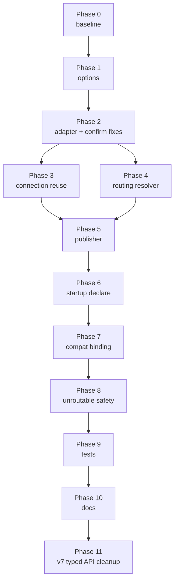

# Messaging Exchange Migration — Implementation Plan

Scope: migrate the publish path from the AMQP default exchange to a topic exchange so multiple independent consumers can be added without changing the API.

Design reference: [../architecture_design/messaging_topology_and_consumer_routing.md](../architecture_design/messaging_topology_and_consumer_routing.md)

Related guidance:

- [repo_architecture_rules.md](repo_architecture_rules.md)
- [shared_engineering_principles.md](shared_engineering_principles.md)
- [implementation_checklist.md](implementation_checklist.md)

---

## Locked decisions

- [x] Exchange type is `topic`, not `fanout`.
- [x] Exchange name is `partner.transactions`, durable.
- [x] Routing key format is `partner.transaction.<outcome>` where outcome is `accepted` or `unverified`.
- [x] The publisher declares the exchange only. Consumers own their queues, bindings, and DLQs.
- [x] `IMessagePublisher` in Core stays transport-agnostic; no exchange or routing-key parameters are added to it.
- [x] The existing `partner-transactions` queue stays functional throughout the migration via a compatibility binding.
- [x] Connection and channel reuse is included in this scope, because it touches the same adapter methods.
- [x] Publisher confirms remain mandatory; a missing confirm continues to fail the request.

---

## Phase 0 — Preconditions

- [x] Confirm the unused manual validator cleanup is already merged so this branch is not mixing unrelated changes (`eddfc13`).
- [x] Capture a baseline: run unit + integration suites and record pass counts (`35` unit tests and `11` integration tests passed).
- [x] Start `docker compose up -d rabbitmq` and confirm the management UI is reachable on `http://localhost:15672` (HTTP `200`).
- [x] Record the current broker topology (durable queue `partner-transactions`, default exchange binding, no custom exchange) as the rollback reference.

---

## Phase 1 — Options model

Target file: [../../src/TransactionValidation.Configuration/Options/RabbitMqOptions.cs](../../src/TransactionValidation.Configuration/Options/RabbitMqOptions.cs)

- [x] Add `ExchangeName` (default `partner.transactions`).
- [x] Add `ExchangeType` (default `topic`).
- [x] Add `RoutingKeyPrefix` (default `partner.transaction`).
- [x] Add `PublishConfirmTimeoutSeconds` (default `5`) to replace the hardcoded 5-second literal in the adapter.
- [x] Keep `QueueName` and `Durable` for now; `QueueName` becomes the compatibility-binding target, not the publish target.
- [x] Convert properties to `{ get; init; }`.

Config files to update with the new keys:

- [x] [../../src/TransactionValidation.Api/appsettings.json](../../src/TransactionValidation.Api/appsettings.json) — `RabbitMq` section
- [x] [../../src/TransactionValidation.Api/appsettings.Development.json](../../src/TransactionValidation.Api/appsettings.Development.json) — `RabbitMq` section
- [x] `.env.example` if broker settings are surfaced as environment variables

Acceptance: the app starts with the new keys absent and falls back to defaults without throwing.

---

## Phase 2 — Adapter contract and implementation

Target files:

- [../../src/TransactionValidation.Messaging/IRabbitMqClientAdapter.cs](../../src/TransactionValidation.Messaging/IRabbitMqClientAdapter.cs)
- [../../src/TransactionValidation.Messaging/RabbitMqClientAdapter.cs](../../src/TransactionValidation.Messaging/RabbitMqClientAdapter.cs)

### 2.1 Contract

- [x] Add `DeclareExchangeAsync(string exchangeName, string exchangeType, bool durable, CancellationToken)`.
- [x] Add `PublishPersistentWithConfirmAsync(string exchangeName, string routingKey, string payload, IReadOnlyDictionary<string, object> headers, CancellationToken)`.
- [x] Keep `DeclareDurableQueueAsync` — the Mock consumer and tests still need queue declaration.
- [x] Retain the old queue-based publish overload until the publisher migration is complete in Phase 5.

### 2.2 Implementation

- [x] Implement `DeclareExchangeAsync` using the reflection compat layer, mirroring the existing `QueueDeclareAsync` fallback ladder in [RabbitMqApiCompat.cs](../../src/TransactionValidation.Messaging/RabbitMqApiCompat.cs).
- [x] Update the exchange-aware publish path to pass `exchangeName` and `routingKey`.
- [x] Set `mandatory: true` on publish so unroutable messages are returned rather than dropped.
- [x] Apply `headers` to the basic-properties instance before publishing.
- [x] Replace the hardcoded `TimeSpan.FromSeconds(5)` confirm timeout with the configured value.

### 2.3 Confirm-path correctness

These are existing defects in the confirm logic that this phase must fix, since the same lines are being edited.

- [x] Check the return value of the `ConfirmSelect` / `ConfirmSelectAsync` invocation. If neither variant resolves, throw instead of continuing — otherwise confirm mode is silently never enabled.
- [x] Replace the terminal `return true` with a thrown exception when no `WaitForConfirms` variant is found. Reporting success without a broker ack turns the publish into fire-and-forget on a client-version change.
- [x] Replace `as bool? ?? true` with explicit handling: a non-boolean confirm result should fail, not default to confirmed.

Acceptance: a forced reflection miss produces a hard failure, not a false success.

---

## Phase 3 — Connection and channel reuse

Target file: [../../src/TransactionValidation.Messaging/RabbitMqClientAdapter.cs](../../src/TransactionValidation.Messaging/RabbitMqClientAdapter.cs)

The adapter currently opens and disposes a connection and channel on every declare and every publish.

- [x] Hold a single long-lived connection in the adapter.
- [x] Hold a channel guarded by a `SemaphoreSlim`, since an AMQP channel is not thread-safe.
- [x] Add lazy initialization that creates the connection and channel on first use.
- [x] Add reconnect handling: on a broker or channel fault, dispose and recreate on the next publish.
- [x] Implement `IAsyncDisposable` and dispose the channel and connection on shutdown.
- [x] Change the DI registration in [ServiceCollectionExtensions.cs](../../src/TransactionValidation.Configuration/Extensions/ServiceCollectionExtensions.cs) so the adapter singleton is disposed by the container.

Acceptance: the adapter now reuses one connection/channel for sequential operations; unit and integration suites pass after the lifecycle change.

---

## Phase 4 — Routing key resolution

New file: `src/TransactionValidation.Messaging/IMessageRoutingKeyResolver.cs`

- [x] Define `IMessageRoutingKeyResolver` with `string Resolve(TransactionEnvelope envelope)`.
- [x] Implement `PartnerTransactionRoutingKeyResolver` returning `{prefix}.accepted` when `PartnerVerified` is true, otherwise `{prefix}.unverified`.
- [x] Register the resolver as a singleton.

Constraint: the resolver lives in Messaging, not Core and not Api. Controllers must never construct routing keys.

Acceptance: unit tests cover both outcomes and confirm the configured prefix is honored (`38` unit tests passed).

---

## Phase 5 — Publisher

Target file: [../../src/TransactionValidation.Messaging/RabbitMqMessagePublisher.cs](../../src/TransactionValidation.Messaging/RabbitMqMessagePublisher.cs)

- [x] Replace the `_queueName` field with `_exchangeName` and inject `IMessageRoutingKeyResolver`.
- [x] Remove the per-publish `DeclareDurableQueueAsync` call.
- [x] Build the header dictionary: `message-type`, `message-version`, `correlation-id`, `message-id`.
- [x] Resolve the routing key, publish once, and keep the existing `ConflictException` on an unconfirmed publish.

Header values:

| Header | Source |
|---|---|
| `message-type` | Constant `PartnerTransactionAccepted` |
| `message-version` | Constant `1` |
| `correlation-id` | `envelope.CorrelationId` |
| `message-id` | `envelope.MessageId` |

Acceptance: `PublishAsync` performs exactly one exchange publish and zero queue declarations; unit and integration suites pass (`38` and `11` tests respectively).

---

## Phase 6 — Startup topology declaration

New file: `src/TransactionValidation.Messaging/RabbitMqTopologyInitializer.cs`

- [x] Implement an `IHostedService` that calls `DeclareExchangeAsync` once at startup.
- [x] Make failure non-fatal but logged as an error, so the API still starts when the broker is briefly unavailable; the first publish will retry declaration.
- [x] Register it in [ServiceCollectionExtensions.cs](../../src/TransactionValidation.Configuration/Extensions/ServiceCollectionExtensions.cs).

Rationale: exchange declaration is idempotent and belongs at startup, not on the request path.

Acceptance: Messaging builds successfully, the non-Docker unit suite passes (`38` tests), and the Docker E2E suite verifies the startup topology and publish path (`5` tests passed).

---

## Phase 7 — Compatibility binding for the existing consumer

The Mock consumer reads from `partner-transactions` and must not break.

Reference: [../../src/TransactionValidation.Mock/Services/RabbitMqNoOpConsumerService.cs](../../src/TransactionValidation.Mock/Services/RabbitMqNoOpConsumerService.cs)

- [x] Add `ExchangeName` and `BindingPattern` (default `partner.transaction.#`) to [RabbitMqConsumerOptions.cs](../../src/TransactionValidation.Mock/Options/RabbitMqConsumerOptions.cs).
- [x] Add a `QueueBindAsync` compat helper in [RabbitMqApiCompat.cs](../../src/TransactionValidation.Messaging/RabbitMqApiCompat.cs).
- [x] In `DeclareQueueIfNeededAsync`, bind the queue to the exchange after declaring it.
- [x] Update [../../src/TransactionValidation.Mock/appsettings.json](../../src/TransactionValidation.Mock/appsettings.json) and its Development variant.

Ordering constraint: this phase must be deployed **before** Phase 5 reaches an environment where the Mock consumer runs. If the publisher switches to the exchange first, messages route nowhere until the binding exists.

Acceptance: implementation compiles and the non-Docker unit suite passes (`38` tests); broker-level consumer verification remains pending.

---

## Phase 8 — Unroutable message safety

- [x] Declare an alternate exchange `partner.transactions.unrouted` and a bound queue `partner-transactions.unrouted`.
- [x] Set the `alternate-exchange` argument when declaring the main exchange.
- [ ] Log a warning when a basic-return is received for a mandatory publish.

Rationale: publisher confirms report broker acceptance, not delivery. A routing key matching no binding is confirmed and discarded. Without this phase, a misconfigured binding is invisible.

---

## Phase 9 — Tests

### 9.1 Unit

- [x] `PartnerTransactionRoutingKeyResolver` — accepted, unverified, custom prefix.
- [x] `RabbitMqMessagePublisher` — asserts exchange name, routing key, and headers passed to a mocked adapter.
- [x] `RabbitMqMessagePublisher` — unconfirmed publish still throws `ConflictException`.
- [x] Publisher no longer calls `DeclareDurableQueueAsync`.

Note: these assert on a mocked `IRabbitMqClientAdapter`, which is acceptable because the adapter boundary is the seam under test. Broker behavior itself is covered in 9.2.

### 9.2 Integration

- [ ] Publish and assert the message arrives on a queue bound with `partner.transaction.#`.
- [ ] Publish and assert a queue bound only to `partner.transaction.accepted` does not receive an unverified message.
- [ ] Assert two queues bound to the same routing key both receive the message — the core multi-consumer guarantee.
- [ ] Assert an unroutable publish lands in `q.unrouted`.
- [ ] Mark all with `[Trait("Category", "Integration")]`.

### 9.3 Regression

- [ ] Existing API host tests still pass unchanged.
- [x] E2E smoke path in [../test/e2e_smoke_matrix.md](../test/e2e_smoke_matrix.md) still passes (`5` passed, `0` failed).

---

## Phase 10 — Documentation sync

- [ ] Update [../architecture_design/Architecture_design.md](../architecture_design/Architecture_design.md) messaging section to reference the exchange topology.
- [ ] Update the mermaid diagram in [../../README.md](../../README.md) so the publish step targets an exchange.
- [ ] Mark the legacy default-exchange section in [../architecture_design/messaging_topology_and_consumer_routing.md](../architecture_design/messaging_topology_and_consumer_routing.md) as retired once Phase 7 completes.
- [ ] Add a short "adding a new consumer" runbook: declare queue, bind pattern, add DLQ, deduplicate on `message-id`.

---

## Phase 11 — RabbitMQ.Client v7 typed API cleanup

The project explicitly pins RabbitMQ.Client `7.0.0` in [../../Directory.Packages.props](../../Directory.Packages.props). Supporting unspecified client versions is out of scope. The reflection-based compatibility layer and legacy confirmation fallbacks add complexity without providing a supported runtime path.

This phase is the final implementation phase for the messaging adapter. It supersedes the version-compatibility portions of Phase 2 while preserving the adapter interface used by the rest of the application.

### 11.1 Remove version-compatibility indirection

Target files:

- [../../src/TransactionValidation.Messaging/RabbitMqApiCompat.cs](../../src/TransactionValidation.Messaging/RabbitMqApiCompat.cs)
- [../../src/TransactionValidation.Messaging/RabbitMqClientAdapter.cs](../../src/TransactionValidation.Messaging/RabbitMqClientAdapter.cs)
- [../../src/TransactionValidation.Messaging/TransactionValidation.Messaging.csproj](../../src/TransactionValidation.Messaging/TransactionValidation.Messaging.csproj)

- [ ] Remove `RabbitMqApiCompat.cs` after all callers have been migrated.
- [ ] Replace `object` connection and channel fields with `IConnection?` and `IChannel?`.
- [ ] Use `ConnectionFactory.CreateConnectionAsync(CancellationToken)` directly.
- [ ] Use `IConnection.CreateChannelAsync(CreateChannelOptions, CancellationToken)` directly.
- [ ] Create the channel with `PublisherConfirmationsEnabled: true` and `PublisherConfirmationTrackingEnabled: true`.
- [ ] Replace reflection-based queue, exchange, and binding declarations with the RabbitMQ.Client v7 `IChannel` methods.
- [ ] Remove `System.Reflection` and any compatibility-only imports that are no longer required.
- [ ] Update XML comments so they describe RabbitMQ.Client v7 rather than multiple client versions.

### 11.2 Simplify publisher confirmation handling

- [ ] Remove `ConfirmSelectAsync`, `ConfirmSelect`, `WaitForConfirmsAsync`, and `WaitForConfirms` calls.
- [ ] Keep `BasicPublishAsync` with `mandatory: true`.
- [ ] Treat successful completion of v7 `BasicPublishAsync` as the broker confirmation.
- [ ] Allow RabbitMQ publish exceptions and channel/connection exceptions to propagate through the existing error and resilience pipeline.
- [ ] Preserve the existing `false` result contract only if the direct adapter implementation has a meaningful non-exception failure path; do not convert missing confirmation support into success.
- [ ] Preserve persistent message properties and the configured headers.

### 11.3 Preserve lifecycle and failure behavior

- [ ] Keep the singleton adapter and shared connection/channel lifecycle from Phase 3.
- [ ] Keep the operation lock around channel operations.
- [ ] Reset and recreate resources after a broker or channel failure.
- [ ] Dispose `IChannel`, `IConnection`, and the operation lock through the existing `IAsyncDisposable` path.
- [ ] Do not introduce a second adapter implementation or runtime package-version detection.

### 11.4 Tests and validation

- [ ] Update adapter unit tests to exercise the v7 channel creation options and publish path.
- [ ] Add a regression test proving a successful v7 `BasicPublishAsync` is treated as confirmed.
- [ ] Add a regression test proving a publish exception is not converted into a successful publish.
- [ ] Keep publisher tests focused on the `IRabbitMqClientAdapter` contract; no RabbitMQ.Client types should leak into Core or Api.
- [ ] Run the complete unit and integration suites.
- [ ] Rebuild the Docker images and run the complete E2E suite.
- [ ] Confirm the five E2E smoke tests pass, including both accepted transaction tests.

Acceptance:

- The Messaging project compiles directly against RabbitMQ.Client `7.0.0` with no reflection compatibility helper.
- Publisher confirmations remain enabled and mandatory.
- The adapter uses typed `IConnection` and `IChannel` APIs.
- A publish is successful only after v7 `BasicPublishAsync` completes successfully.
- Unit, integration, and E2E suites are green.

Implementation order:

```text
1. Migrate connection and channel creation
2. Migrate queue, exchange, and binding declarations
3. Migrate publish and confirmation handling
4. Remove RabbitMqApiCompat.cs and compatibility-only references
5. Update focused tests
6. Run unit, integration, and E2E validation
```

---

## Execution order



Phases 3 and 4 are independent and can be done in either order.

---

## Deployment sequence

Because the publisher and consumer are separate processes, ordering matters in a running environment.

| Step | Deploy | Risk if skipped |
|---|---|---|
| 1 | Exchange declaration (Phase 6) | None; declaring an unused exchange is inert |
| 2 | Consumer binding (Phase 7) | Messages route nowhere after step 3 |
| 3 | Publisher switch (Phase 5) | — |
| 4 | Verify consumer drain | Silent message loss goes unnoticed |
| 5 | Remove legacy config | — |

Rollback: revert the publisher to default-exchange publishing. The queue and its messages are untouched, so no data is lost.

---

## Definition of done

- [ ] The API publishes one message to `partner.transactions` per accepted transaction.
- [ ] Two queues bound to the same routing key both receive it.
- [ ] The Mock consumer works without code changes beyond the binding.
- [ ] One broker connection is used across many publishes.
- [ ] A missing confirm still returns a failure to the caller.
- [ ] A reflection miss on confirm APIs fails loudly instead of silently succeeding.
- [ ] The adapter uses the pinned RabbitMQ.Client 7.0.0 typed API without reflection compatibility code.
- [ ] Unroutable messages are captured and logged.
- [ ] Unit and integration suites are green.
- [ ] No exchange or routing-key concepts appear in Core or Api.

---

## Out of scope

- Per-consumer publisher implementations or a publisher-side list of destinations. Both reintroduce producer-to-consumer coupling.
- Replacing the in-memory idempotency store with Redis.
- Consumer-side retry/backoff policies beyond DLQ declaration.
- Schema registry or contract-testing tooling.
