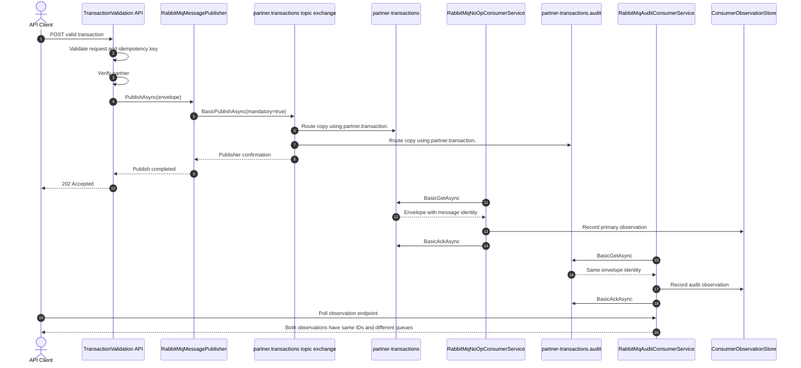

# Multiple Consumer POC - Independent RabbitMQ Queues

## 1. Purpose

This plan describes the local proof of concept for multiple independent RabbitMQ consumers. The POC demonstrates that one message published to the shared topic exchange is delivered to two separate queues, allowing both consumers to receive their own copy.

The POC is local to the Mock project. It is not an Azure Function implementation and does not include Azure hosting or networking.

## 2. Target Behavior

```text
One publication
    -> partner.transactions
        -> partner-transactions
            -> RabbitMqNoOpConsumerService
        -> partner-transactions.audit
            -> RabbitMqAuditConsumerService
```

Both consumers must observe the same `message-id` and `correlation-id`, while consuming from different queues.

## 3. Locked Decisions

- [x] Use the existing durable topic exchange `partner.transactions`.
- [x] Keep `RabbitMqNoOpConsumerService` as the primary consumer.
- [x] Add `RabbitMqAuditConsumerService` as the second local consumer.
- [x] Give each consumer a distinct durable queue.
- [x] Bind both queues to the same exchange.
- [x] Use `partner.transaction.#` for the initial fan-out proof.
- [x] Keep the publisher unaware of consumer names and queue names.
- [x] Keep one independent durable queue per consumer; consumers must not share a queue.
- [x] Verify fan-out through a broker-backed E2E test.
- [x] Keep the implementation local and intentionally small.

## 4. Current Implementation

### 4.1 Consumer options

The two consumers use separate concrete option classes that inherit shared broker and exchange settings from `RabbitMqConsumerOptions`:

- `RabbitMqPrimaryConsumerOptions` loads the `RabbitMqConsumer` section.
- `RabbitMqAuditConsumerOptions` loads the `RabbitMqAuditConsumer` section.

Each concrete class owns its queue and binding settings. No `OptionsName` or named-options lookup is required because dependency injection distinguishes the classes by type.

Configuration sections provide all required values explicitly. The options classes do not define runtime defaults.

### 4.2 Queue and binding ownership

| Consumer | Queue | Binding |
|---|---|---|
| `RabbitMqNoOpConsumerService` | `partner-transactions` | `partner.transaction.#` |
| `RabbitMqAuditConsumerService` | `partner-transactions.audit` | `partner.transaction.#` |

Both consumers share:

- RabbitMQ host and credentials.
- Exchange `partner.transactions`.
- Topic exchange routing.

They do not share queues. A shared queue would create competing consumers and each message would be delivered to only one service. The approved POC design explicitly excludes shared queues.

### 4.3 Implemented components

- `src/TransactionValidation.Mock/Options/RabbitMqConsumerOptions.cs`
- `src/TransactionValidation.Mock/Options/RabbitMqPrimaryConsumerOptions.cs`
- `src/TransactionValidation.Mock/Options/RabbitMqAuditConsumerOptions.cs`
- `src/TransactionValidation.Mock/Services/RabbitMqNoOpConsumerService.cs`
- `src/TransactionValidation.Mock/Services/RabbitMqAuditConsumerService.cs`
- `src/TransactionValidation.Mock/Services/ConsumerObservationStore.cs`
- `src/TransactionValidation.Mock/Controllers/ConsumerObservationController.cs`
- `src/TransactionValidation.Mock/Program.cs`
- `src/TransactionValidation.Mock/appsettings.json`
- `src/TransactionValidation.Mock/appsettings.Development.json`
- `docker-compose.yml`
- `tests/TransactionValidation.Tests/E2E/TransactionValidationE2ESmokeTests.cs`

### 4.4 Observation mechanism

The Mock project records observations in `ConsumerObservationStore`. Each observation contains:

- Consumer name.
- Queue name.
- Message ID.
- Correlation ID.
- Routing key.
- Observation timestamp.

The test-support endpoint is:

```text
GET /api/v1/mock/consumer-observations/{consumerName}
```

The API does not expose or manage consumer state.

## 5. Runtime Interaction



## 6. Implementation Phases and Status

### Phase 0 - Baseline and topology confirmation

- [x] Confirm the solution builds before the POC change.
- [x] Run the existing unit and integration suites.
- [x] Run the existing five-case E2E suite.
- [x] Confirm the primary consumer receives the existing transaction message.
- [x] Record the exchange, queues, bindings, and alternate-exchange names.

Evidence before the POC: solution build passed, unit tests passed, integration tests passed, and the original five E2E tests passed.

### Phase 1 - Consumer-specific options

- [x] Define separate primary and audit option classes inheriting `RabbitMqConsumerOptions`.
- [x] Bind `RabbitMqPrimaryConsumerOptions` to `RabbitMqConsumer`.
- [x] Bind `RabbitMqAuditConsumerOptions` to `RabbitMqAuditConsumer`.
- [x] Provide complete configuration for both consumers in Mock appsettings files.
- [x] Provide Docker environment mappings for the audit consumer.
- [x] Use different queue names for the two consumers.

### Phase 2 - Second background consumer

- [x] Add `RabbitMqAuditConsumerService`.
- [x] Use RabbitMQ.Client `7.0.0` typed APIs.
- [x] Declare and bind only `partner-transactions.audit` in the audit service.
- [x] Poll with `BasicGetAsync`.
- [x] Acknowledge with `BasicAckAsync` after observation.
- [x] Retry connection and channel failures while the host is running.
- [x] Register the service independently from the primary consumer.

### Phase 3 - POC topology ownership

- [x] Retain the current self-initializing topology for the local POC.
- [x] Keep the primary consumer’s existing shared topology declarations for now.
- [x] Keep the audit consumer limited to its own queue and binding.
- [ ] Move shared exchange and alternate-exchange provisioning to infrastructure for production use.

The duplicated shared declaration behavior is acceptable for this local POC but should not become the production ownership model.

### Phase 4 - Deterministic observation

- [x] Add `ConsumerObservationStore`.
- [x] Record message ID, correlation ID, routing key, and queue name.
- [x] Record observations for both consumers.
- [x] Expose observations through the Mock-only endpoint.
- [x] Keep the API publisher and contract unchanged.

### Phase 5 - Fan-out E2E scenario

- [x] Add an E2E test with a unique transaction and idempotency key.
- [x] Wait for the primary consumer observation.
- [x] Wait for the audit consumer observation.
- [x] Assert both observations have the same message ID.
- [x] Assert both observations have the same correlation ID.
- [x] Assert the queue names differ.
- [x] Assert both observations use `partner.transaction.accepted`.

### Phase 6 - Selective routing proof

- [x] Change the audit binding to `partner.transaction.accepted`.
- [x] Publish an accepted transaction and assert both consumers receive it through the fan-out test.
- [x] Publish an unverified transaction and assert only the primary consumer receives it.
- [x] Keep selective routing separate from the basic fan-out test.

### Phase 7 - Failure isolation proof

The approved one-Mock-service design proves consumer-level isolation and redelivery. Process-level isolation is intentionally deferred because both consumers run in the same Mock process.

- [x] Add targeted, one-shot failure control before audit acknowledgement.
- [x] Verify the primary consumer continues processing its own queue copy.
- [x] Verify an audit message that is not acknowledged is redelivered.
- [x] Verify the audit consumer acknowledges the redelivered message.
- [ ] Stop or disable the audit process independently; deferred because the POC uses one Mock process.
- [ ] Add explicit competing-consumer coverage; shared queues are excluded from the approved design.

### Phase 8 - Documentation and scope closure


- [x] Update the architecture topology document with the two-queue POC.
- [x] Update the E2E smoke matrix with the multiple-consumer tests.
- [x] Record the POC evidence and queue configuration.
- [x] Document that this is not an Azure Function deployment.
- [x] Keep Azure Function planning out of this local POC scope.

## 7. Validation Evidence

The implementation has been validated with:

```text
Solution build: succeeded, 0 warnings, 0 errors
Unit tests: 37 passed, 0 failed
Integration tests: 11 passed, 0 failed
E2E tests: 8 passed, 0 failed in the latest recorded run
```

The E2E suite includes the original smoke cases, independent-queue fan-out, selective routing, and audit redelivery after a forced failure before acknowledgement.

## 8. Definition of Done

- [x] Two background consumers run in the Mock project.
- [x] Each consumer has a different durable queue.
- [x] Both queues bind independently to `partner.transactions`.
- [x] The publisher publishes once and knows nothing about consumers.
- [x] Both consumers observe the same message and correlation IDs.
- [x] The fan-out E2E test passes.
- [x] Existing E2E smoke tests continue to pass.
- [x] Unit and integration tests pass.
- [x] Selective routing is implemented and verified.
- [x] Consumer-level failure isolation and redelivery are implemented and verified.
- [ ] Process-level isolation is verified; deferred because the POC uses one Mock process.
- [ ] Shared topology ownership is moved to infrastructure.
- [ ] Azure Function deployment is evaluated separately.

## 9. Next Step

The local multiple-consumer POC is complete. The next optional improvement is infrastructure-owned shared topology:

```text
Provision shared topology -> move exchange setup out of consumer startup
Retain consumer ownership -> each consumer keeps its own queue and binding
Keep Azure out of scope   -> no Azure Function work is required for this POC
```

The approved queue model remains unchanged: one independent durable queue per consumer, with no shared queue.
